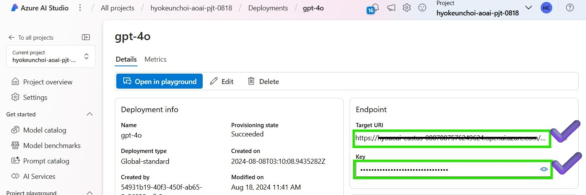

# Lab 0. Requirements (Skip if you have already set up)

## 1. Requirements

### Checklist

{: .note }
Customers who participate in this hands-on lab will need to discuss with their Microsoft sales representative and complete the checklist. The checklist will ultimately be completed by the sales representative, but we ask that you cooperate in completing the checklist to ensure the right situation/right person is involved.

{: .warning}
Please create a resource in one of following regions when creating a AI Document Intelligence resource: **East-US, West-US2, West-Europe**. Otherwise, you may encounter a 404 error when trying to access the resource. ([Source](https://learn.microsoft.com/en-us/answers/questions/1514842/document-intelligence-ai-returns-404))

### Hands-on Requirements
- Ensure you have access to Azure OpenAI Service.
- Set up your Azure ML workspace and get your `<WORKSPACE_NAME>`, `<RESOURCE_GROUP>` and `<SUBSCRIPTION_ID>`.
- create a project in Azure AI Studio.
- For LLM training, recommend a single NVIDIA A100 node (`Standard_NC24ads_A100_v4`)  or NVIDIA V100 GPU node (`Standard_NC6s_v3`). 
- Opt for Low-priority VMs if on a budget or without a dedicated quota.

### Cautions
- If configuring in a private environment, set up a private network or VPN to access services.
- Low-priority VM availability may vary by region.
- Set up connections for any blob storage used to store data and models within the Azure ML workspace.
- Request a quota increase if necessary for VMs or GPUs.
- Network config in Azure ML workspace cannot be changed post-setup; create a new workspace if required.
- Ensure compute instances are in the same region as the Azure ML workspace; otherwise, set up a VPN or private link.
- If using Azure AI Studio compute instances, note that training jobs cannot be executed on them.

Please ensure these points are followed to avoid common issues during the workshop.

## 2. Setup Compute Instance and the configuration file
- 1️⃣ Prepare your compute resource
- 2️⃣ Clone the repository
- 3️⃣ Create `.env` file and Add Azure OpenAI and Azure Document Intelligence details
- 4️⃣ Setup config.yml
- 🚀 Get started to validate the setup 

### 1️⃣ Prepare your compute resource
1. Create your compute instance in Azure ML Studio. Navigate to the Azure ML Studio > Compute > Compute instances and create a new compute instance.


2. For code development, we recommend `Standard_DS11_v2` (2 cores, 14GB RAM, 28GB storage, No GPUs). Click on the `Review+Create` button to create the compute instance.

3. Once the compute instance is created and change the status as Running, click on the `Jupyter` or `VS Code(Desktop)` to open the Jupyter notebook and terminal.


### 2️⃣ Clone the repository and install the required packages
1. Go to your terminal in your evironment and clone the repository. 

```shell
git clone https://github.com/Azure/slm-innovator-lab.git
```


2. Install all Python modules and packages listed in the requirements.txt file using the below command.

```shell
cd slm-innovator-lab # Change to the directory where the repository is cloned
ENVIRONMENT=azureml_py310_sdkv2
conda activate "$ENVIRONMENT"
pip install -r requirements.txt
```

3. If you want to use the Unstructured toolkit for processing a complex PDF, please be sure to execute `startup_unstructured.sh` and include it in your instance startup script.

```shell
./startup_unstructured.sh
```

### 3️⃣ Create `.env` file and Add Azure OpenAI and Azure Document Intelligence details
1. Please do not forget to modify the `.env` file to match your account. Rename `.env.sample` to `.env` or copy and use it.

```shell
# .env
# this is a sample for keys used in this code repo. 
# Please rename it to .env before you can use it
AZURE_OPENAI_ENDPOINT=xxxxxxxxxxxxxxxxxxxxxxxxxxxxxxxx
AZURE_OPENAI_API_KEY=xxxxxxxxxxxxxxxxxxxxxxxxxxxxxxxx

# https://learn.microsoft.com/en-us/azure/ai-services/openai/api-version-deprecation
AZURE_OPENAI_API_VERSION=2024-08-01-preview
AZURE_OPENAI_DEPLOYMENT_NAME=gpt-4o-mini

AZURE_DOC_INTELLIGENCE_ENDPOINT=xxxxxxxxxxxxxxxxxxxxxxxxxxxxxxxx
AZURE_DOC_INTELLIGENCE_KEY=xxxxxxxxxxxxxxxxxxxxxxxxxxxxxxxx
```

2. In order to match your Azure OpenAI authentication information in the `.env` file, please navigate to Azure AI Studio > Deployments > your model deployment to get the Azure OpenAI endpoint and API key after deploying the Azure Open AI models. If you want to understand the LLM deployment process, please refer to the [How to deploy Azure OpenAI models with Azure AI Studio](https://learn.microsoft.com/en-us/azure/ai-studio/how-to/deploy-models-openai).


3. If you want to read and preprocess pdf files during this lab, you need to add the Azure Document Intelligence endpoint and API key to the `.env` file. In order to match your Azure Document Intelligence authentication. Please navigate to Azure AI services Document Intelligence > your model deployment to get the Azure Document Intelligence endpoint and API key after deploying the Azure Document Intelligence models.If you want to understand the Document Intelligence creation process, please refer to the [Create a Document Intelligence resource](https://learn.microsoft.com/en-us/azure/ai-services/document-intelligence/create-document-intelligence-resource?view=doc-intel-4.0.0).


### 4️⃣ Setup config.yml
To get your subscription ID, resource group, and workspace name, go to Azure ML Studio and open your profile. Modify the `2_slm-fine-tuning-mlstudio/phi3/config.yml` file to match your Azure subscription, resource group, workspace, and data name. 


```yaml
config:
    AZURE_SUBSCRIPTION_ID: "<YOUR-SUBSCRIPTION-ID>" # Please modify to your subscription
    AZURE_RESOURCE_GROUP: "<YOUR-RESOURCE-GROUP>" # Please modify to your Azure resource group
    AZURE_WORKSPACE: "<YOUR-AZURE-WORKSPACE>" # Please modify to your Azure workspace
    AZURE_DATA_NAME: "hf-ultrachat" # Please modify to your AzureML data name
    DATA_DIR: "./dataset"
    CLOUD_DIR: "./cloud"
    HF_MODEL_NAME_OR_PATH: "microsoft/Phi-3.5-mini-instruct"
    IS_DEBUG: true
    USE_LOWPRIORITY_VM: true
    ...
```


### 🚀 Get started to validate the setup 
Proceed by opening the [Jupyter notebook](get_started.ipynb), and follow the steps provided.