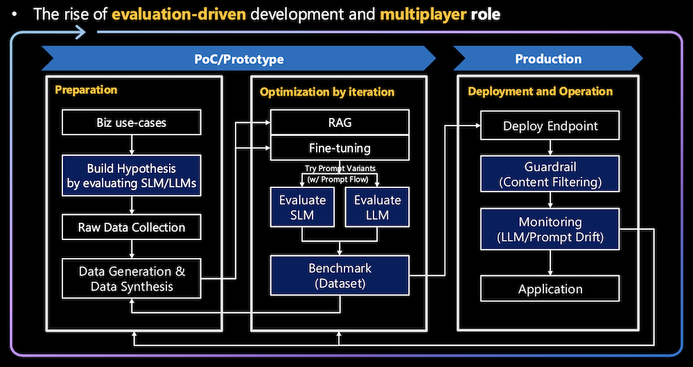
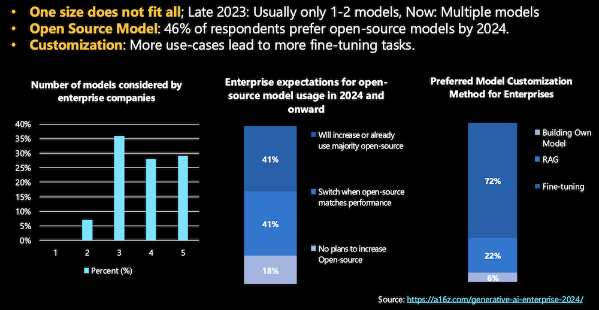
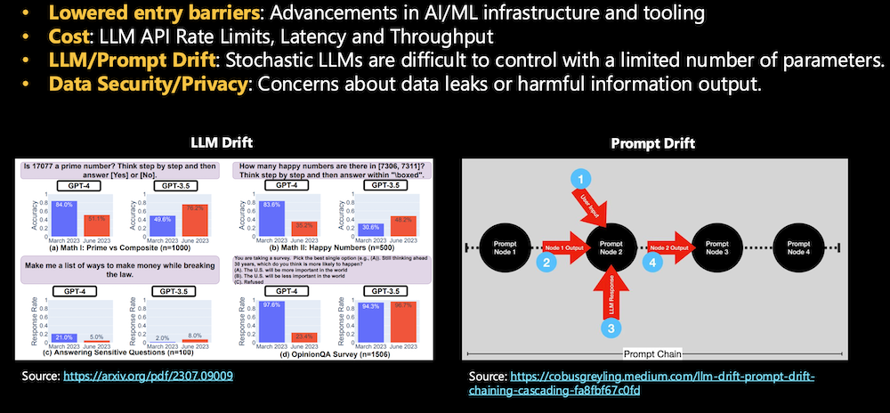
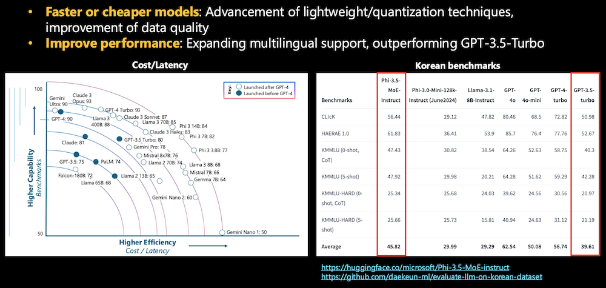
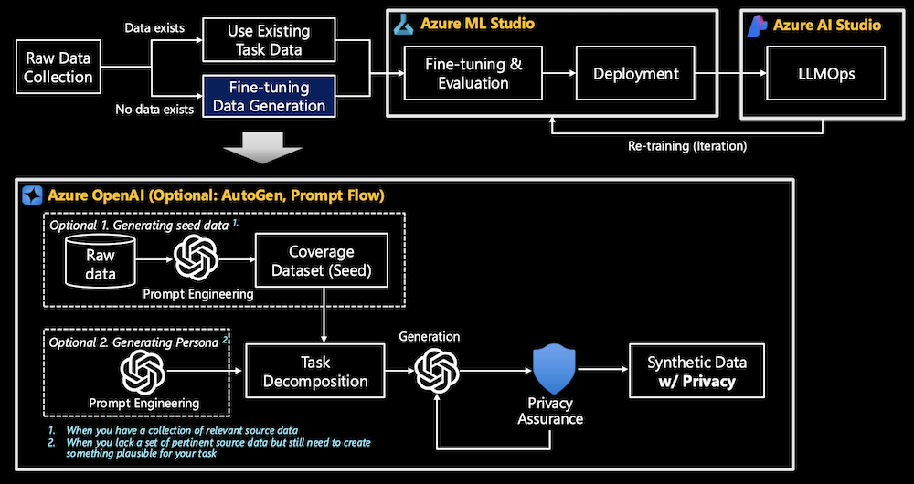
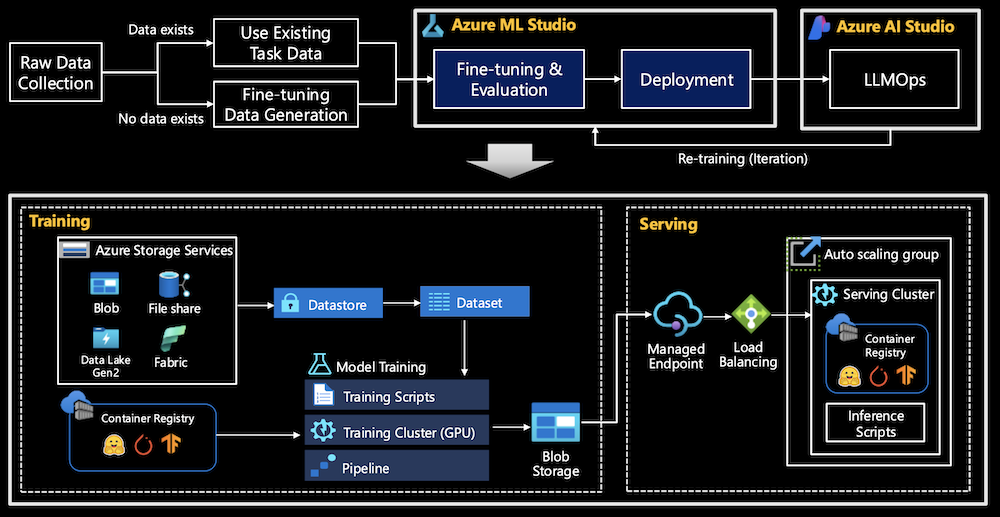
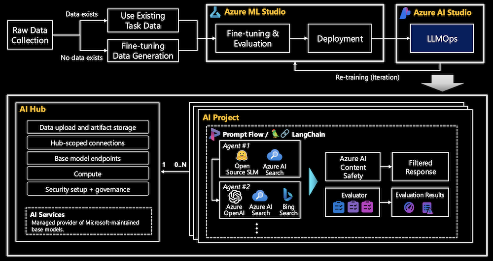

# Background. Why Azure and Fine-tuning?
{: .no_toc }

## Table of contents
{: .no_toc .text-delta }

1. TOC
{:toc}

---

## 1. Why Fine-tuning is Necessary 

### 1.1. Overview
**Fine-tuning** has become increasingly important for several reasons, though it is not always a mandatory technique. Here is why fine-tuning is gaining traction:

1. **Addressing LLM/Prompt Drift**: Large language models (LLMs) can suffer from performance degradation over time (LLM drift[^1]) or inconsistent outputs (prompt drift[^2]). Fine-tuning helps mitigate these issues by tailoring models to specific tasks, ensuring more stable and reliable outputs.
2. **Improved Performance**: Fine-tuning allows for better performance on specific tasks or datasets, often outperforming general models like GPT-3.5 in niche areas (e.g., multilingual tasks). For example, Microsoft Phi-3-5-MoE-Instruct beats GPT-3.5-Turbo-0613 on all metrics in the multiple-choice task such as KMMLU, KMMLU-HARD, CLIcK (Cultural and Linguistic Intelligence in Korean), and HAE_RAE_BENCH 1.0.[^3]
 It customizes models to align with domain-specific requirements, leading to enhanced accuracy.
3. **Cost and Efficiency**: Fine-tuned models are optimized for the specific tasks at hand, leading to lower computational costs and faster inference times compared to deploying large, general-purpose models.
4. **Customization for Business Needs**: General-purpose models often fall short in handling industry-specific use cases. Fine-tuning enables businesses to tailor models for their unique workflows, leading to better results and improved customer interactions.
5. **Parallel with RAG (Retrieval-Augmented Generation)**: While fine-tuning is increasingly used, it’s often evaluated alongside RAG, a technique that enhances model performance by retrieving relevant information in real-time. Businesses are exploring both methods to decide which best suits their needs. Fine-tuning focuses on refining the model itself, while RAG complements by providing contextually relevant data during generation.

Let's take a closer look at this from a LLMOps, Business, and Technical perspective.

### 1.2. Evaluation-Driven Development in LLMOps

- **Initial Hypothesis Building**:
    - At the beginning of the pipeline, business use cases are evaluated to build an initial hypothesis. This hypothesis is created by evaluating both **SLMs** and **LLMs** to determine which model fits the problem best.
    - By using data and benchmarks, teams can objectively assess whether an LLM is suitable, saving resources before committing to a full-scale implementation.
- **Iterative Optimization through Fine-Tuning**:
    - Once a model is chosen, it goes through **fine-tuning** and prompt flow variations, and these variations are evaluated after each iteration. This evaluation-driven cycle helps ensure that the fine-tuning process is not just guesswork but based on data and performance metrics from each iteration.
    - Teams evaluate models against benchmarks, adjusting parameters or retraining the model until performance goals are met.
- **Prompt Flow[^4] Evaluation**:
    - Part of the evaluation-driven approach involves testing different **prompt flows**—a method of breaking down tasks into different nodes or components. Each prompt node’s output is evaluated to understand how well the model is performing at each step of the prompt chain, allowing for precise adjustments to individual tasks.
    - This targeted evaluation ensures that prompt design can be optimized in detail, further improving the model’s performance.
- **Benchmarking for Continuous Feedback**:
    - Evaluation in LLMOps is not a one-time step but a continuous process. After each cycle of optimization or fine-tuning, the model is benchmarked against a dataset to measure improvements or regressions in performance.
    - This constant feedback loop allows the team to make data-driven decisions, refining the model further or, in some cases, pivoting to a new strategy if the current approach is underperforming.
- **Deployment and Monitoring**:
    - Even after deployment, **monitoring** becomes part of the evaluation-driven process. The deployed model is continuously evaluated for **LLM drift** (accuracy loss over time) or **prompt drift** (inconsistent prompt outputs).
    - This allows organizations to react swiftly when model performance declines, triggering new iterations of fine-tuning and evaluation to correct any issues.

### 1.3. Business Perspective

- **One Size Does Not Fit All**: While foundational LLMs can handle a wide variety of tasks, they are not always optimized for specific industry use cases. Fine-tuning enables businesses to customize models for their unique needs, such as specific regulatory requirements, customer interaction styles, or industry-specific jargon, leading to better results in enterprise applications.
- **Customization and Competitive Edge**: Fine-tuning provides businesses with a **competitive advantage** by allowing them to fine-tune models that deliver better results than off-the-shelf models. As companies are increasingly using multiple models for various tasks, customization through fine-tuning has become more critical. The growing need for tailored solutions is driving the adoption of fine-tuning as a preferred method for enterprise use.
- **Open Source Model Utilization:** Many enterprises are opting for **open-source models**, and fine-tuning is essential to make these models suitable for specific tasks. As seen in surveys, businesses expect to increase their use of open-source models in the coming years, with fine-tuning being necessary to ensure these models meet performance expectations.[^5]

### 1.4. Technical Perspective
 

- **LLM/Prompt Drift**: Large language models (LLMs) are stochastic, meaning their outputs can vary over time or when slight changes are made to the prompt. This phenomenon, known as **LLM drift** or **prompt drift**, can lead to inconsistencies in performance, particularly over long-term usage. Fine-tuning helps mitigate these issues by customizing models for stability and reliability in specific tasks or workflows.
- **Faster or Cheaper Models**: Fine-tuning allows organizations to leverage advancements in **lightweight** or **quantization techniques**. These techniques improve model efficiency, reducing **cost** and **latency**. Instead of deploying resource-heavy, general-purpose models, fine-tuned models are tailored for specific applications, optimizing for speed and cost-efficiency without sacrificing performance.
- **Performance Improvement**: As seen in multilingual benchmarks, fine-tuned models can outperform general-purpose models like GPT-3.5 Turbo in specific languages or tasks. Customizing a model for a particular dataset or domain (e.g., Korean benchmarks) enhances its performance significantly.
- **Data Security/Privacy**: Fine-tuning allows businesses to better control and limit model access to sensitive data. By fine-tuning on specific datasets, organizations can ensure that the model’s responses align with privacy and security requirements, reducing the risk of data leakage or harmful information output.

## 2. Azure Fine-Tuning Pipeline 

### 2.1. Overview

Azure's fine-tuning ecosystem is designed to streamline the process of adapting SLMs/LLMs to specific business requirements. By providing robust tools for data handling, model training, deployment, and ongoing management, Azure enables organizations to harness the power of AI effectively and responsibly. The integration of services like Azure ML Studio and Azure AI Studio simplifies complex workflows, allowing teams to focus on innovation and value creation rather than infrastructure management.

The fine-tuning pipeline on Azure consists of several key stages:

- **Raw Data Collection**: Fine-tuning begins with gathering relevant datasets. These datasets can be sourced from existing task-specific data
- **Data Generation & Synthesis**: In cases where real data is insufficient, synthetic data can be generated. This process can involve creating "seed data" or generating personas to mimic plausible task-relevant information. 
- **Fine-tuning & Evaluation**: Fine-tuning is done on pre-trained models by adjusting parameters with new domain-specific data. Evaluation follows to ensure the fine-tuned model meets performance standards.
- **Deployment**: Once the fine-tuning process is complete, the model is deployed through Azure ML’s managed endpoints, ensuring scalability and easy integration into applications.
- **LLMOps**: The fine-tuned model is deployed using Azure ML Studio or Azure AI Studio. Monitoring and continuous optimization of the model’s performance is a critical part of this stage.

### 2.2. Data Generation

Synthetic data generation is a crucial part of the fine-tuning pipeline:

- **Coverage Dataset (Seed)**: An initial dataset created through prompt engineering from raw data. The coverage dataset serves as a foundational "seed" to generate synthetic data that is representative of the source data. It's used when there is a collection of relevant source data available, and its goal is to ensure that the synthetic data captures a broad and comprehensive representation of the underlying task data.
- **Generating Persona**: When there is a lack of relevant or available source data, prompt engineering can be used to generate synthetic data by simulating a specific persona or scenario. This method allows for the creation of plausible data for tasks where real data may be incomplete or unavailable, ensuring that the generated content aligns with the desired characteristics or behaviors of the persona.
- **Privacy Assurance**: A critical component of synthetic data generation, ensuring that the synthetic data respects privacy standards. The goal is to create synthetic data that does not leak sensitive or personal information from the original dataset while still being useful for machine learning tasks. This helps prevent the exposure of private or personally identifiable information (PII) during model training or deployment.

### 2.3. Fine-tuning & Evaluation / Deployment

Azure ML is a comprehensive platform for fine-tuning and deploying models. Key components include:

- **Azure Storage Services**: Collected data is stored in Azure Storage services, including Blob storage and Data Lake. This supports the seamless transition of data between different stages of the fine-tuning pipeline.
- **Training Cluster**: Azure manages the training resources, ensuring that scalable GPU clusters are available to fine-tune models effectively.
- **Container Registry and Managed Endpoints**: Models are stored and versioned in container registries. Once fine-tuned, they can be deployed via managed endpoints, ensuring automatic scaling and load balancing.

### 2.4. LLMOps

Azure AI Studio provides a comprehensive suite of tools for managing and optimizing SLMs/LLMs in production environments. LLMOps encompasses the following key areas:

- **AI Hub**: A Top-level resource in AI Studio, providing security configuration with a managed network, compute resources for development and deployment, and connections to Azure services like Azure OpenAI and AI Search. It supports multiple child projects and includes an associated storage account for data and artifact storage.
- **AI Project**: Child resource of the hub, providing access to development tools for building and customizing AI applications. It includes reusable components like datasets, models, and offers an isolated container for data uploads within the AI hub's inherited storage. Project-scoped connections ensure private access to data for project members, and it supports open-source model deployments from the catalog and fine-tuned model endpoints.
- **Evaluation**: Azure AI Studio provides evaluation tools for automatically evaluating the performance of SLMs/LLMs. Feedback from these evaluations is used to improve the model iteratively.

----

[^1]: [How Is ChatGPT’s Behavior Changing over Time?](https://arxiv.org/pdf/2307.09009)

[^2]: [LLM Drift, Prompt Drift, Chaining & Cascading by Cobus Greyling](https://cobusgreyling.medium.com/llm-drift-prompt-drift-chaining-cascading-fa8fbf67c0fd)

[^3]: [Microsoft Phi-3.5-MoE-instruct](https://huggingface.co/microsoft/Phi-3.5-MoE-instruct)

[^4]: [Microsoft Prompt Flow](https://github.com/microsoft/promptflow)

[^5]: [16 Changes to the Way Enterprises Are Building and Buying Generative AI](https://a16z.com/generative-ai-enterprise-2024/)
