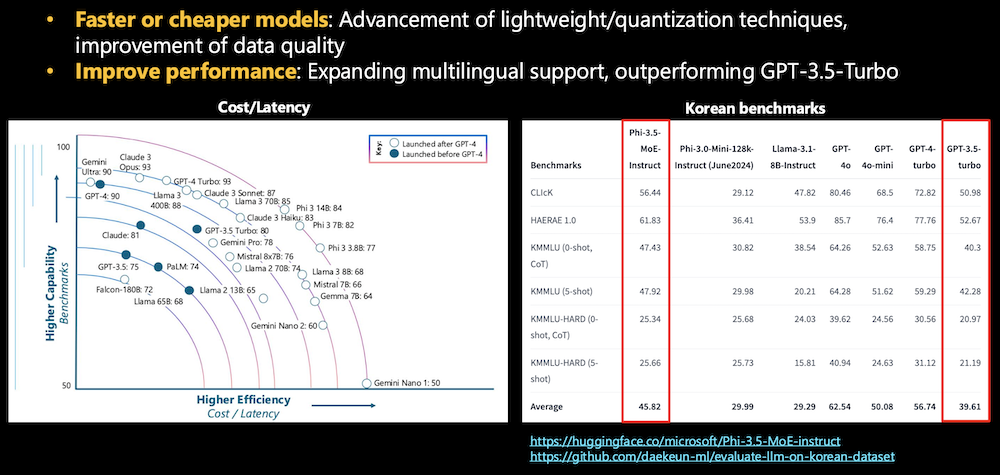
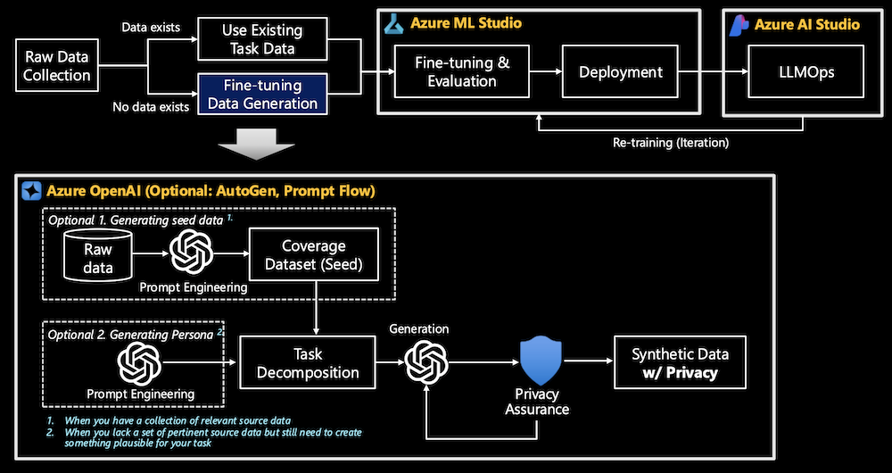

# Background. Why Azure and Fine-tuning?
{: .no_toc }

## 目次
{: .no_toc .text-delta }

1. 目次
{:目次}

---

## 1. なぜファインチューニングが必要なのか 

### 1.1. 概要
**ファインチューニング**は 、いくつかの理由でますます重要になっていますが、必ずしも必須の手法ではありません。ここでは、ファインチューニングが注目を集めている理由をご紹介します。

1. **LLM/プロンプトドリフトへの対処**: 大規模言語モデル (LLM) は、時間の経過に伴うパフォーマンスの低下 (LLM ドリフト[^1]) や一貫性のない出力 (プロンプトドリフト)[^2] に悩まされる可能性があります。ファインチューニングは、モデルを特定のタスクに合わせて調整することでこれらの問題を軽減し、より安定した信頼性の高い出力を確保するのに役立ちます。
2. **パフォーマンスの向上**: ファインチューニングにより、特定のタスクやデータセットでパフォーマンスが向上し、多くの場合、ニッチな領域 (多言語タスクなど) では GPT-3.5 などの一般的なモデルよりも優れたパフォーマンスを発揮します。たとえば、Microsoft Phi-3-5-MoE-Instruct は、KMMLU、KMMLU-HARD、CLIcK (韓国語の文化的および言語的知性)、HAE_RAE_BENCH 1.0 などの多肢選択タスクのすべてのメトリックで GPT-3.5-Turbo-0613 を上回っています。[^3]
 ドメイン固有の要件に合わせてモデルをカスタマイズし、精度の向上につながります。
3. **コストと効率**: ファインチューニングされたモデルは、手元の特定のタスクに合わせて最適化されているため、大規模な汎用モデルをデプロイする場合と比較して、計算コストが低く、推論時間が短縮されます。
4. **ビジネスニーズに合わせたカスタマイズ**:汎用モデルは、業界固有のユースケースの処理に不十分な場合がよくあります。ファインチューニングにより、企業は独自のワークフローに合わせてモデルを調整でき、より良い結果と顧客との対話の改善につながります。
5. **RAG(Retrieval-Augmented Generation)との並行**: ファインチューニングの使用が増加する一方で、関連情報をリアルタイムで取得することでモデルのパフォーマンスを向上させる手法であるRAGと一緒に評価されることがよくあります。企業は、どちらがニーズに最も適しているかを決定するために、両方の方法を模索しています。ファインチューニングはモデル自体の改良に重点を置いていますが、RAGは生成中にコンテキストに関連するデータを提供することで補完します。

これを LLMOps、ビジネス、および技術の観点から詳しく見てみましょう。

### 1.2. LLMOpsでの評価駆動型開発

- **初期仮説の構築**:
    - パイプラインの開始時に、ビジネスユースケースが評価され、初期仮説が立てられます。この仮説は、**SLM** と **LLM** の両方を評価して、どちらのモデルが問題に最も適合するかを判断することによって作成されます。
    - データとベンチマークを使用することで、チームはLLMが適切かどうかを客観的に評価でき、本格的な実装に取り組む前にリソースを節約できます。
- **ファインチューニングによる反復的な最適化**:
    - モデルが選択されると、 **ファインチューニング** と迅速なフローのバリエーションが行われ、これらのバリエーションは各反復後に評価されます。この評価主導のサイクルにより、ファインチューニングプロセスが単なる推測ではなく、各イテレーションのデータとパフォーマンス メトリックに基づいていることを確認できます。
    - チームは、パフォーマンス目標が達成されるまで、ベンチマークに対してモデルを評価し、パラメーターを調整したり、モデルを再トレーニングしたりします。
- **プロンプトフロー[^4] 評価**:
    - 評価主導型アプローチの一部には、さまざまな **プロンプトフロー**のテスト(タスクをさまざまなノードまたはコンポーネントに分割する方法)が含まれます。各プロンプト・ノードの出力が評価され、プロンプト・チェーンの各ステップでモデルがどの程度うまく機能しているかが理解され、個々のタスクを正確に調整できます。
    - この的を絞った評価により、プロンプト設計を詳細に最適化し、モデルのパフォーマンスをさらに向上させることができます。
- **継続的なフィードバックのためのベンチマーク**:
    - LLMOpsでの評価は、1回限りのステップではなく、継続的なプロセスです。最適化またはファインチューニングの各サイクルの後、モデルはデータセットに対してベンチマークされ、パフォーマンスの改善または回帰が測定されます。
    - この絶え間ないフィードバックループにより、チームはデータドリブンな意思決定を行い、モデルをさらに改良したり、場合によっては現在のアプローチのパフォーマンスが低い場合は新しい戦略に軸足を移すことができます。
- **デプロイメントとモニタリング**:
    - デプロイ後も、**監視**は評価主導のプロセスの一部になります。デプロイされたモデルは、**LLM ドリフト** (時間の経過に伴う精度の損失) または**プロンプト ドリフト** (一貫性のないプロンプト出力) について継続的に評価されます。
    - これにより、モデルはパフォーマンスが低下したときに迅速に対応でき、問題を修正するためのファインチューニングと評価を新たに繰り返すことができます。

### 1.3. ビジネスの視点

- **1つのサイズですべてに対応できるわけではありません**:基本的なLLMはさまざまなタスクを処理できますが、特定の業界のユースケースに常に最適化されているわけではありません。ファインチューニングにより、企業は特定の規制要件、顧客との対話スタイル、業界固有の専門用語など、独自のニーズに合わせてモデルをカスタマイズでき、エンタープライズアプリケーションでより良い結果を得ることができます。
- **カスタマイズと競争力:** ファインチューニングにより、既製のモデルよりも優れた結果をもたらすモデルをファインチューニングできるため、企業は**競争上の優位性**を得ることができます。企業がさまざまなタスクに複数のモデルを使用することが増えるにつれて、ファインチューニングによるカスタマイズがより重要になっています。カスタマイズされたソリューションに対するニーズの高まりにより、企業での使用に適した方法としてファインチューニングが採用されています。
- **オープンソースモデルの活用:**多くの企業が**オープンソースモデル**を選択しており、これらのモデルを特定のタスクに適したものにするにはファインチューニングが不可欠です。調査で明らかになったように、企業は今後数年間でオープンソースモデルの使用を増やすと予想しており、これらのモデルがパフォーマンスの期待に応えられるようにするためのファインチューニングが必要です。[^5]

### 1.4. 技術的な視点
 

- **LLM/プロンプトドリフト**:大規模言語モデル(LLM)は確率的であり、時間の経過とともに出力が変化するか、プロンプトにわずかな変更が加えられた場合に変化する可能性があります。この現象は、**LLMドリフト**または**プロンプトドリフト**と呼ばれ、特に長期間の使用では、パフォーマンスに一貫性がなくなる可能性があります。ファインチューニングは、特定のタスクやワークフローの安定性と信頼性のためにモデルをカスタマイズすることで、これらの問題を軽減するのに役立ちます。
- **より高速または安価なモデル**:ファインチューニングにより、組織は**軽量**または**量子化技術**の進歩を活用できます。これらの手法により、モデルの効率が向上し、**コスト**と**レイテンシ**が削減されます。リソースを大量に消費する汎用モデルをデプロイするのではなく、ファインチューニングされたモデルを特定のアプリケーションに合わせて調整し、パフォーマンスを犠牲にすることなく速度とコスト効率を最適化します。
- **パフォーマンスの向上**: 多言語ベンチマークに見られるように、ファインチューニングされたモデルは、特定の言語やタスクで GPT-3.5 Turbo のような汎用モデルよりも優れたパフォーマンスを発揮することができます。特定のデータセットまたはドメイン(例:韓国のベンチマーク)に合わせてモデルをカスタマイズすると、そのパフォーマンスが大幅に向上します。
- **データセキュリティ/プライバシー**:ファインチューニングにより、企業は機密データへのモデルアクセスをより適切に制御および制限できます。特定のデータセットをファインチューニングすることで、組織はモデルの応答がプライバシーとセキュリティの要件と一致していることを確認でき、データ漏洩や有害な情報出力のリスクを軽減できます。

## 2. Azure のファインチューニングパイプライン 

### 2.1. 概要

Azure のファインチューニングエコシステムは、SLM/LLM を特定のビジネス要件に適合させるプロセスを効率化するように設計されています。Azure は、データ処理、モデルのトレーニング、デプロイ、継続的な管理のための堅牢なツールを提供することで、組織が AI の力を効果的かつ責任を持って活用できるようにします。Azure ML Studio や Azure AI Studio などのサービスの統合により、複雑なワークフローが簡素化され、チームはインフラストラクチャ管理ではなく、イノベーションと価値創造に集中できます。

Azure のファインチューニング パイプラインは、いくつかの主要なステージで構成されています。

- **生データの収集**: ファインチューニングは、関連するデータセットを収集することから始まります。これらのデータセットは、既存のタスク固有のデータから取得できます
- **データ生成と合成**:実際のデータが不十分な場合は、合成データを生成できます。このプロセスには、「シードデータ」の作成や、もっともらしいタスク関連情報を模倣するペルソナの生成が含まれる場合があります。 
- **ファインチューニングと評価**: ファインチューニングは、新しいドメイン固有のデータでパラメーターを調整することにより、事前トレーニング済みモデルに対して行われます。ファインチューニングされたモデルが性能基準を満たしていることを確認するために、評価が行われます。
- **デプロイ**: ファインチューニングプロセスが完了すると、モデルは Azure ML のマネージド エンドポイントを介してデプロイされるため、スケーラビリティが確保され、アプリケーションへの統合が容易になります。
- **LLMOps**: ファインチューニングされたモデルは、Azure ML Studio または Azure AI Studio を使用してデプロイされます。モデルのパフォーマンスの監視と継続的な最適化は、この段階の重要な部分です。

### 2.2. データ生成

合成データの生成は、パイプラインのファインチューニングの重要な部分です。

- **カバレッジデータセット(シード**):生データからプロンプトエンジニアリングによって作成された初期データセット。カバレッジ データセットは、ソース データを代表する合成データを生成するための基本的な "シード" として機能します。これは、関連するソース データのコレクションが利用可能な場合に使用され、その目標は、合成データが基になるタスク データの広範かつ包括的な表現を確実にキャプチャすることです。
- **ペルソナの生成**: 関連するソースデータや利用可能なソースデータが不足している場合、プロンプトエンジニアリングを使用して、特定のペルソナやシナリオをシミュレートして合成データを生成できます。この方法により、実際のデータが不完全または利用できない可能性のあるタスクに対して、もっともらしいデータを作成できるため、生成されたコンテンツがペルソナの望ましい特性や行動と一致することが保証されます。
- **プライバシー保証**:合成データ生成の重要な要素であり、合成データがプライバシー基準を尊重していることを確認します。目標は、元のデータセットから機密情報や個人情報を漏洩させない合成データを作成しながら、機械学習タスクに有用であることです。これにより、モデルのトレーニングまたはデプロイ中に個人情報や個人を特定できる情報 (PII) が公開されるのを防ぐことができます。

### 2.3. ファインチューニング & 評価 / デプロイ

Azure ML は、モデルをファインチューニングしてデプロイするための包括的なプラットフォームです。主なコンポーネントは次のとおりです。

- **Azure Storage サービス**: 収集されたデータは、Blob Storage や Data Lake などの Azure Storage サービスに格納されます。これにより、ファインチューニング パイプラインの異なるステージ間でのデータのシームレスな移行がサポートされます。
- **トレーニング クラスター**: Azure はトレーニング リソースを管理し、モデルを効果的にファインチューニングするためにスケーラブルな GPU クラスターを使用できるようにします。
- **コンテナレジストリと管理対象エンドポイント**: モデルはコンテナレジストリに保存され、バージョン管理されます。ファインチューニングが完了すると、管理されたエンドポイントを介してデプロイできるため、自動スケーリングと負荷分散が保証されます。

### 2.4. LLMOps

Azure AI Studio には、運用環境で SLM/LLM を管理および最適化するための包括的なツール スイートが用意されています。LLMOpsには、次の主要な領域が含まれます。

- **AI Hub**: AI Studio の最上位のリソースで、マネージド ネットワークによるセキュリティ構成、開発とデプロイ用のコンピューティング リソース、Azure OpenAI や AI Search などの Azure サービスへの接続を提供します。複数の子プロジェクトをサポートし、データと成果物のストレージに関連付けられたストレージ アカウントが含まれています。
- **AIプロジェクト**:ハブの子リソースで、AIアプリケーションを構築およびカスタマイズするための開発ツールへのアクセスを提供します。データセットやモデルなどの再利用可能なコンポーネントが含まれており、AIハブの継承されたストレージ内にデータをアップロードするための分離されたコンテナを提供します。プロジェクト スコープの接続により、プロジェクト メンバーのデータへのプライベート アクセスが確保され、カタログからのオープンソース モデルのデプロイとファインチューニングされたモデルのエンドポイントがサポートされます。
- **評価**: Azure AI Studio には、SLM/LLM のパフォーマンスを自動的に評価するための評価ツールが用意されています。これらの評価からのフィードバックは、モデルを反復的に改善するために使用されます。

----

[^1]: [ChatGPTの行動は時間の経過とともにどのように変化していますか?](https://arxiv.org/pdf/2307.09009)

[^2]: [LLM Drift, Prompt Drift, Chaining & Cascading by Cobus Greyling (英語)](https://cobusgreyling.medium.com/llm-drift-prompt-drift-chaining-cascading-fa8fbf67c0fd)

[^3]: [マイクロソフト ファイ-3.5-MoE-インストラクション](https://huggingface.co/microsoft/Phi-3.5-MoE-instruct)

[^4]: [Microsoft プロンプト フロー](https://github.com/microsoft/promptflow)

[^5]: [企業がジェネレーティブAIを構築および購入する方法の16の変化](https://a16z.com/generative-ai-enterprise-2024/)
