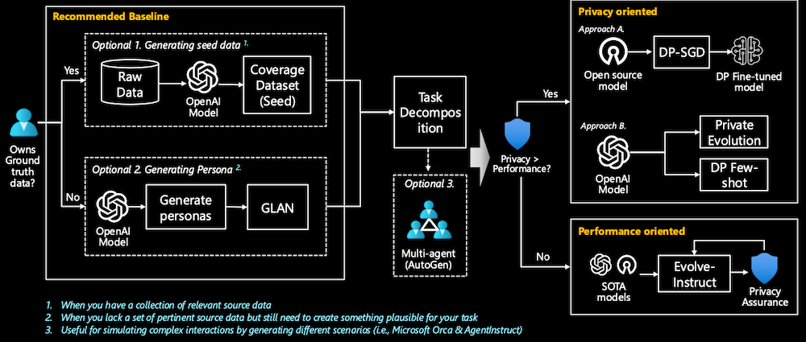
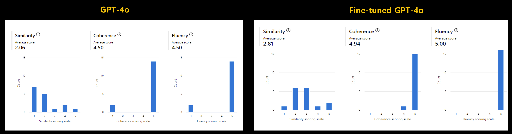
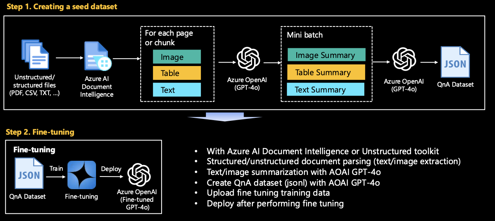
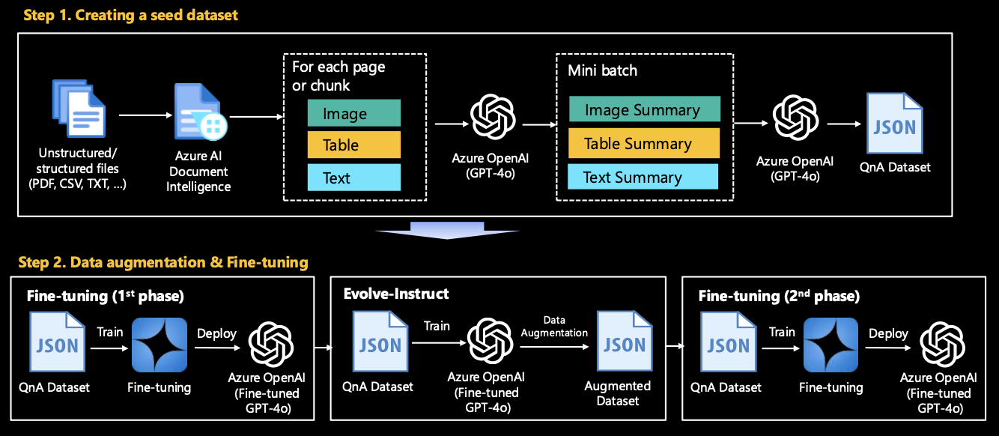
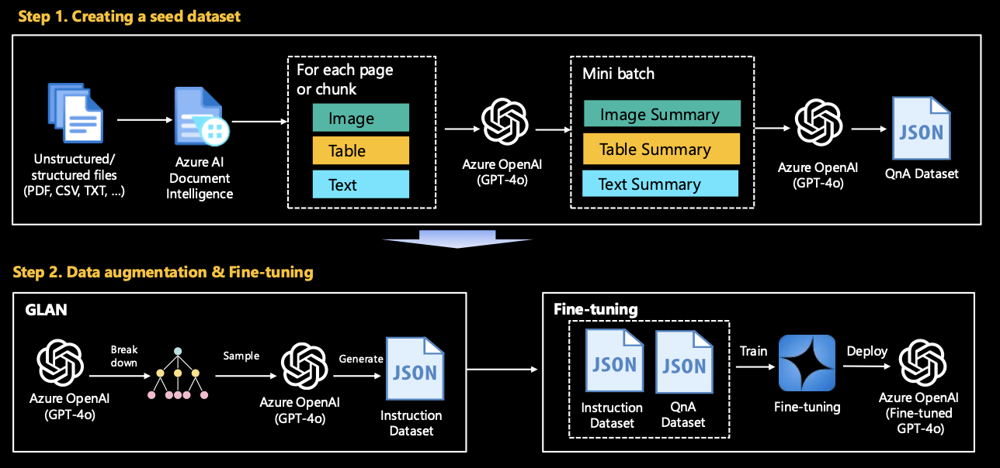

[日本語](README_ja.md)

# Lab 1. Generate Synthetic QnAs from Real-world Data
{: .no_toc }

## Table of contents
{: .no_toc .text-delta }

1. TOC
{:toc}

---

For LLM/SLM fine-tuning, RAG, or evaluation, it is often necessary to generate data in Q&A format from real-world raw data. However, in scenarios where you need to create a dataset from scratch, rather than from a ready-made dataset, you will face many challenges.

This hands-on lab aims to alleviate some of that headache by demonstrating how to create/augment a QnA dataset from complex unstructured data, assuming a real-world scenario. The sample aims to be step-by-step for developers and data scientists, as well as those in the field, to try it out with a little help.

## 1. How to get started 
Any option is fine, but you may wish to refer to the instructions below:
- For engineers or practitioners in the field who want to use this hands-on in PoC/MVP, we recommend Option 1.
- For instructors who want to use this hands-on in their workshops, we recommend Option 2.
- For developers in the field who want to launch a production, we recommend Option 3.

### Option 1. Azure AI Studio or Azure ML Studio
Create your compute instance. For code development, we recommend `Standard_DS11_v2` (2 cores, 14GB RAM, 28GB storage, No GPUs).

If you want to use the Unstructured toolkit for processing a complex PDF, please be sure to include `startup_unstructured.sh` in your instance startup script.

### Option 2. GitHub Codespace
Please start a new project by connecting to Codespace Project. The environment required for hands-on is automatically configured through devcontainer, so you only need to run a Jupyter notebook.

### Option 3. Your local PC
Please start by installing the required packages on your local PC with `cd .. && pip install -r requirements.txt`

## 2. Overview

### Why we need Synthetic data?

Synthetic data may not always be necessary, but it can be crucial in certain cases. It allows for scalable dataset generation without privacy concerns, reduces time spent on manual labeling, enables the simulation of new scenarios, and helps retrain models to counteract data drift or introduce updated information.

- **Scalable**: Many real-world tasks, especially those involving machine learning, require vast amounts of data to achieve optimal performance. Synthetic data enables scaling by generating large datasets without the cost or time constraints of collecting real-world data.
- **Privacy and Safety**: Using real data often involves handling sensitive information, which can raise privacy and security concerns. Synthetic data eliminates these issues by creating artificial data that mirrors the structure of real data without compromising sensitive details.
- **Labeling**: Manually labeling large datasets is a labor-intensive and time-consuming process. Synthetic data can come pre-labeled, drastically reducing the time and effort needed for human annotation while ensuring consistency.
- **Pre-assessing**: Synthetic data allows for simulating new or rare scenarios that may not be well-represented in real datasets. This enables better testing and validation of models before deploying them in real-world situations.
- **Retraining**: Over time, models can become outdated due to data drift or new trends. Synthetic data provides an efficient way to retrain models, ensuring they stay up-to-date without the need for continuously collecting fresh real-world data.

### Baseline decision tree

This diagram represents a decision-making process for generating and using synthetic data in a machine learning context, depending on data availability and priorities like privacy and performance.
When you lack a set of pertinent source data but still need to create something plausible for your task

- **Recommended Baseline**:
    - The process begins by determining whether the user owns sufficient ground truth data. If the user has relevant source data, they can proceed with **Option 1: Generating Seed Data**. This involves taking raw data and feeding it into an Azure OpenAI model to produce a **Coverage Dataset (Seed)**. This is useful when you have a collection of relevant source data.
    - If users lack a set of pertinent source data but still need to create something plausible for their task, they can proceed with **Option 2: Generating Personas**, which utilize **GLAN (Generalized Instruction Tuning)** (a specific method for generating data developed by Microsoft).
    - There is an additional **Optional 3** step, which involves using a **Multi-agent system (AutoGen)**. This step helps simulate complex interactions and scenarios, which could be useful for tasks like simulating interactions between agents in environments like Microsoft Orca or AgentInstruct.
- **Task Decomposition**:
    - The output from these baseline steps (Coverage Dataset, Personas, etc.) enters a **Task Decomposition** phase, where the specific data needs and considerations are evaluated.
- **Privacy or Performance Priority**:
    - Next, the decision-making process asks if privacy is more important than performance:
        - **If privacy is prioritized**:
            - **Approach A**: Use **DP-SGD** (Differentially Private Stochastic Gradient Descent) to create a differentially private fine-tuned model from an open-source model.
            - **Approach B**: Utilize **Private Evolution**, starting from an OpenAI model and leveraging **DP Few-shot** learning to ensure privacy while fine-tuning.
        - **If performance is prioritized**:
            - Use the **Evolve-Instruct** approach, which takes state-of-the-art models (SOTA models) and refines them while maintaining **Privacy Assurance** during training.

This flowchart thus guides users through a structured approach to synthetic data generation and model fine-tuning, balancing privacy and performance based on available resources and goals.

## 3. Scenario

We aims to enhance the model's performance by fine-tuning/RAG (Retrieval-Augmented Generation), providing a high-quality dataset. However, no pre-existing dataset is provided; we only have unprocessed raw data in formats such as PDF, CSV, and TXT. This raw data consists of a mixture of images, tables, and text.

### 3.1. Constructing a coverage dataset (seed data) 
The task is to preprocess and convert this heterogeneous data into a structured format suitable for fine-tuning or RAG. This involves extracting and cleaning text from various file formats, converting tables and images to text using Azure AI Services if necessary. This dataset is used as a seed dataset for fine tuning or RAG and is used as a baseline to improve the performance of domain-specific use cases.

### 3.2. Data Augmentation (Optional)
After fine-tuning with the generated dataset, a baseline was established, but the performance requires improvement due to lack of data (e.g., there are only 1,000 samples in the dataset). In this case, a synthetic dataset must be created by applying data augmentation techniques to enhance performance. The data augmentation technique utilizes the representative techniques announced by Microsoft: Evol-Instruct, GLAN (Generalized Instruction Tuning), and Auto Evol-Insruct.

### 3.3. Customer application examples
Below is a comparison of the results before and after fine tuning of GPT-4o without RAG for customer PoC. GPT-4o is available to a small number of customers as a private preview as of July 2024. This is the result of creating a set of 16 questions and answers for PoC and comparing three indicators of **Similarity, Coherence, and Fluency** in Azure AI studio. The values ​​of the indicator are on a scale of 1-5, with higher values ​​being better.

## 4. Contents

### 4.1. Constructing a coverage dataset (seed data) 

Convert the given raw data into data that can be used for model training/RAG/evaluation using Azure OpenAI GPT-4o. `make_qa_multimodal_pdf_docai.ipynb` is most recommended. However, if you feel that the logic of this code is complicated, or if your file content consists only of images or text, please try looking at other Jupyter notebooks first.
Run the Jupyter notebook in the **[seed](seed)** folder.

#### PDF
- `make_qa_multimodal_pdf_docai.ipynb`: (Recommended) Generate QnA synthetic dataset from a Complex PDF using Azure AI Document Intelligence.
- `make_qa_multimodal_pdf_oss.ipynb`:  Generate QnA synthetic dataset from a Complex PDF using Open source (Unstructured toolkit for this hands-on). To run this file, you first need to install the required packages with `startup_unstructured.sh`. The installation will take a few minutes.
- `make_qa_only_image_multiple_pdf.ipynb`: Generate QnA synthetic dataset from multiple PDFs - Image-heavy PDF.
- `make_qa_only_image_pdf.ipynb`: Generate QnA synthetic dataset from a PDF - Image-heavy PDF.

#### CSV
- `make_qa_csv.ipynb`: This is the general case. It is not difficult to create a QnA dataset by reading and chunking with CSVLoader.

### 4.2. Data Augmentation (Optional)
Leverage Microsoft's research to generate more high-quality and complex data. Once you have established a baseline in Stage 1, experiment with this step for even better results. By utilizing the concepts of Evolve-Instruct and GLAN, you can fine tune into your LLM specialized for a specific industry/technology domain.

#### 4.2.1. [Evolve-Instruct](evolve-instruct/README.md)

We can perform data augmentation based on the seed dataset created in Stage 1. Please see **[evolve-instruct/README](evolve-instruct/README.md)** for more details.

#### 4.2.2. [GLAN (Generalized Instruction Tuning)](glan-instruct/README.md)

GLAN can be performed independently without the need to go through Stage 1. This is because it covers all generalized domains. Please see **[glan-instruct/README](glan-instruct/README.md)** for more details.