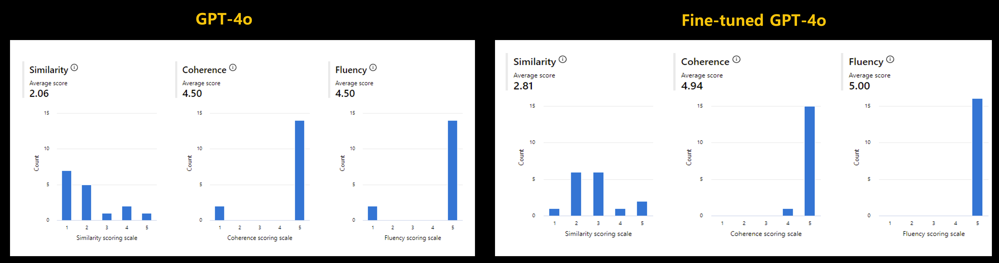

[English](README.md)

# Lab 1. Generate Synthetic QnAs from Real-world Data
{: .no_toc }

## Table of contents
{: .no_toc .text-delta }

1. TOC
{:toc}

---

LLM/SLMのファインチューニング、RAG、または評価のために、実世界の生データからQ&A形式でデータを生成する必要があることがよくあります。 ただし、既製のデータセットからではなく、データセットを最初から作成する必要があるシナリオでは、多くの課題に直面します。

このハンズオン ラボは、実際のシナリオを想定して、複雑な非構造化データから QnA データセットを作成/拡張する方法を示すことで、その頭痛の種の一部を軽減することを目的としています。 このサンプルは、開発者やデータ サイエンティスト、および現場の人々が少しの助けを借りて試すための段階的なものになることを目指しています。

## 1. 利用開始方法 
どのオプションでも問題ありませんが、以下の手順を参照することをお勧めします。
- この分野のエンジニアや実務家で、このハンズオンをPoC/MVPで活用したい方には、オプション1をお勧めします。
- このハンズオンをワークショップで使用したい講師には、オプション2をお勧めします。
- 本番環境を立ち上げたい現場の開発者には、オプション 3 をお勧めします。

### オプション1.Azure AI Studio または Azure ML Studio
コンピューティング インスタンスを作成します。 コード開発には、`Standard_DS11_v2`(2コア、14GBのRAM、28GBのストレージ、GPUなし)をお勧めします。 

複雑なPDFの処理に非構造化ツールキットを使用する場合は、インスタンスの起動スクリプトに`startup_unstructured.sh`を必ず含めてください。 

### オプション2.GitHub Codespace
Codespace Project に接続して、新しいプロジェクトを開始してください。 ハンズオンに必要な環境は devcontainer を通じて自動的に構成されるため、Jupyter Notebook を実行するだけで済みます。

### オプション3.ローカル PC
まず、必要なパッケージをローカルPCにインストールしてください。`cd .. && pip install -r requirements.txt`

## 2. 概要

### なぜ合成データが必要なのですか?

合成データは必ずしも必要ではありませんが、場合によっては重要になることがあります。 これにより、プライバシーを懸念することなくスケーラブルなデータセット生成が可能になり、手動のラベリングに費やす時間が短縮され、新しいシナリオのシミュレーションが可能になり、データドリフトを打ち消したり更新された情報を導入したりするためのモデルの再トレーニングに役立ちます。

- **スケーラブル**: 多くの現実世界のタスク、特に機械学習に関連するタスクでは、最適なパフォーマンスを実現するために大量のデータが必要です。 合成データは、実世界のデータを収集するコストや時間の制約なしに、大規模なデータセットを生成することでスケーリングを可能にします。 
- **プライバシーと安全性**: 実際のデータを使用するには、機密情報の取り扱いが含まれることが多く、プライバシーやセキュリティ上の懸念が生じる可能性があります。 合成データは、機密性の高い詳細を損なうことなく、実際のデータの構造を反映した人工データを作成することで、これらの問題を解消します。 
- **ラベリング**: 大規模なデータセットに手動でラベルを付けるのは、手間と時間のかかるプロセスです。 合成データには事前にラベルが付けられているため、一貫性を確保しながら、人間によるアノテーションに必要な時間と労力を大幅に削減できます。 
- **事前評価**: 合成データを使用すると、実際のデータセットでは十分に表現されない可能性のある新しいシナリオや珍しいシナリオをシミュレートできます。 これにより、モデルを実際の状況にデプロイする前に、モデルのテストと検証をより適切に行うことができます。 
- **再トレーニング**: 時間の経過とともに、データのドリフトや新しい傾向により、モデルが古くなる可能性があります。 合成データは、モデルを再トレーニングする効率的な方法を提供し、新しい実世界のデータを継続的に収集することなく、モデルを最新の状態に保ちます。 

### ベースライン デシジョンツリー(決定木)

この図は、データの可用性とプライバシーやパフォーマンスなどの優先順位に応じて、機械学習のコンテキストで合成データを生成して使用するための意思決定プロセスを表しています。
関連するソースデータのセットが不足しているが、それでもタスクに適したものを作成する必要がある場合

- **推奨ベースライン**:
    - このプロセスは、ユーザーが十分なグラウンドトゥルースデータを所有しているかどうかを判断することから始まります。 ユーザーが関連するソース データを持っている場合は、**オプション 1: シード データの生成** に進むことができます。 これには、生データを取得し、それを Azure OpenAI モデルにフィードして **カバレッジ データセット (シード)** を生成することが含まれます。 これは、関連するソース データのコレクションがある場合に便利です。 
    - ユーザーが関連するソース データのセットを欠いているが、タスクに適したものを作成する必要がある場合は、**GLAN (Generalized Instruction Tuning)** (Microsoft が開発したデータを生成するための特定の方法) を利用する **オプション 2: ペルソナの生成** に進むことができます。 
    - 追加の**オプション3**ステップがあり、これには**マルチエージェントシステム（AutoGen））の使用が含まれます。 この手順は、複雑な対話とシナリオをシミュレートするのに役立ち、Microsoft Orca や AgentInstruction などの環境でのエージェント間の対話をシミュレートするなどのタスクに役立つ場合があります。 
- **タスクの分解**:
    - これらのベースラインステップ(カバレッジデータセット、ペルソナなど)からの出力は、特定のデータニーズと考慮事項が評価される**タスク分解**フェーズに入ります。 
- **プライバシーまたはパフォーマンスの優先**:
    - 次に、意思決定プロセスでは、プライバシーがパフォーマンスよりも重要であるかどうかを尋ねます。
        - **プライバシーを優先する場合**:
            - **アプローチA**:**DP-SGD**(Differentially Private Stochastic Gradient Descent)を使用して、オープンソースモデルから微分プライベートな微調整モデルを作成します。
            - **アプローチB**:OpenAIモデルから始めて、**DP Few-shot**学習を活用して、微調整しながらプライバシーを確保する**Private Evolution**を活用します。 
        - **パフォーマンスを優先する場合**:
            - **Evolve-Instruct** アプローチを使用して、最先端のモデル (SOTA モデル) を取り入れ、トレーニング中に **プライバシー保証** を維持しながらそれらを改良します。 

したがって、このフローチャートは、合成データの生成とモデルの微調整、利用可能なリソースと目標に基づいてプライバシーとパフォーマンスのバランスをとるための構造化されたアプローチを通じてユーザーをガイドします。

## 3.シナリオ

fine-tuning/RAG(Retrieval-Augmented Generation)によりモデルの性能向上を図り、高品質なデータセットを提供します。 ただし、既存のデータセットは提供されません。 PDF、CSV、TXTなどの形式の未処理の生データのみがあります。 この生データは、画像、表、テキストの組み合わせで構成されています。

### 3.1.カバレッジデータセット(シードデータ)の構築
タスクは、この異種データを前処理し、微調整またはRAGに適した構造化形式に変換することです。 これには、さまざまなファイル形式からのテキストの抽出とクリーニング、必要に応じて Azure AI Services を使用したテーブルと画像のテキストへの変換が含まれます。 このデータセットは、微調整やRAGのシードデータセットとして使用され、ドメイン固有のユースケースのパフォーマンスを向上させるためのベースラインとして使用されます。

### 3.2.データ拡張(オプション)
生成されたデータセットで微調整を行った結果、ベースラインが確立されましたが、データが不足している(データセットにサンプルが1,000個しかないなど)ため、パフォーマンスの改善が必要です。 この場合、パフォーマンスを向上させるために、データ拡張手法を適用して合成データセットを作成する必要があります。 データ拡張手法は、マイクロソフトが発表した代表的な手法であるEvol-Instruct、GLAN(Generalized Instruction Tuning)、およびAuto Evol-Insructを利用しています。

### 3.3.お客様のアプリケーション例
以下は、顧客PoCのためのGPT-4oのRAGなしの微調整前と後の結果の比較です。 GPT-4o は、2024 年 7 月現在、プライベート プレビューとして一部のお客様にご利用いただけます。 これは、PoC の 16 の質問と回答のセットを作成し、Azure AI Studio で **類似性、一貫性、流暢性** の 3 つのインジケーターを比較した結果です。 指標の値は1〜5のスケールで、値が高いほど優れています。 

## 4. コンテンツ

### 4.1.カバレッジデータセット(シードデータ)の構築

与えられた生データを、Azure OpenAI GPT-4o を使用したモデルのトレーニング/RAG/評価に使用できるデータに変換します。 `make_qa_multimodal_pdf_docai.ipynb`が最も推奨されます。 ただし、このコードのロジックが複雑だと感じた場合や、ファイルの内容が画像やテキストのみで構成されている場合は、まず他の Jupyter Notebook を試してみてください。
Jupyter ノートブックを **[seed](seed)** フォルダーで実行します。 

#### PDFで見る
- `make_qa_multimodal_pdf_docai.ipynb`: (推奨) Azure AI Document Intelligence を使用して、複雑な PDF から QnA 合成データセットを生成します。
- `make_qa_multimodal_pdf_oss.ipynb`: オープンソースを使用して、複雑なPDFからQnA合成データセットを生成します(このハンズオン用の非構造化ツールキット)。 このファイルを実行するには、まず必要なパッケージを `startup_unstructured.sh` でインストールする必要があります。 インストールには数分かかります。 
- `make_qa_only_image_multiple_pdf.ipynb`: 複数の PDF から QnA 合成データセットを生成します - 画像の多い PDF。
- `make_qa_only_image_pdf.ipynb`: PDF から QnA 合成データセットを生成します - 画像の多い PDF。

#### CSVファイル
- `make_qa_csv.ipynb`: 一般的なケースです。 CSVLoader で読み取ってチャンクすることで QnA データセットを作成することは難しくありません。

### 4.2.データ拡張(オプション)
Microsoft の研究を活用して、より高品質で複雑なデータを生成します。 ステージ 1 でベースラインを確立したら、このステップを試して、さらに良い結果を得てください。 Evolve-InstructとGLANの概念を活用することで、特定の業界/技術領域に特化したLLMを微調整することができます。

#### 4.2.1. [Evolve-Instruct (進化指示)](evolve-instruct/README.md)

Stage 1で作成したシードデータセットに基づいてデータ拡張を行うことができます。 詳細については、**[evolve-instruct/README](evolve-instruct/README.md)** をご覧ください。 

#### 4.2.2.GLAN[ (Generalized Instruction Tuning) (一般化命令チューニング)](glan-instruct/README.md)

GLANは、ステージ1を経ることなく、独立して実行できます。 これは、すべての一般化されたドメインをカバーしているためです。 詳細は [glan-instruct/README](glan-instruct/README.md)** をご覧ください。 