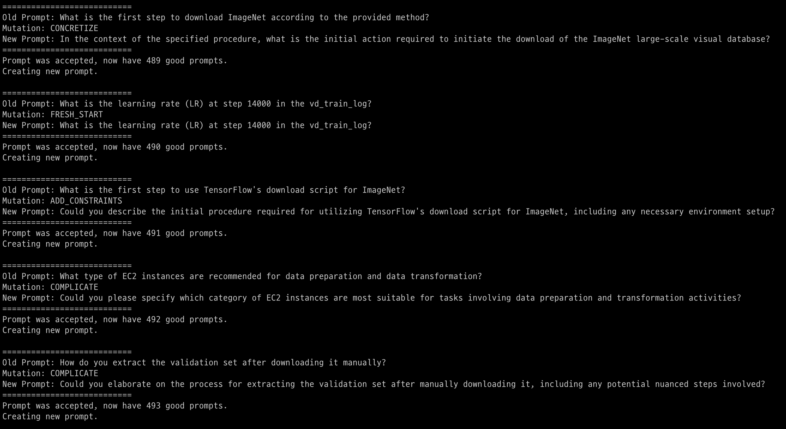

[English](README.md)

# Evolve-Instruct

## 概要
Evolve Instructメソッドは、既存の命令データを変更(拡張)することにより、より多様で複雑な命令を作成します。これを実現するために、この手法ではGPT-4oなどのLLMを利用して、既存の命令を書き換えたり変換したりします。特に、命令をより複雑にしたり、新しい命令を作成したりするために、In-depth Evolving と In-breadth Evolving の 2 つの戦略を使用します。

- In-depth Evolving: 命令に制約を追加したり、より具体的にしたり、論理的な推論のステップを増やしたり、入力を複雑にしたりして、命令をより難しくします。
- In-wideth Evolving: 既存のコマンドに基づいてまったく新しいコマンドを作成し、トピックとテクノロジの範囲を拡大し、データセットの多様性を高めます。

## 実装
このオープンソースの実装は、[WizardLMの論文](https://arxiv.org/abs/2304.12244)と[h2o-wizardlm](https://github.com/h2oai/h2o-wizardlm)に基づいています。
元の実装に次の機能が追加されました。

- クラスを追加することで Azure OpenAI を呼び出せるように変更しました`AzureGPTPipeline`。
- プロンプトは、複数の言語をサポートするように改良および変更されました。 他の言語を指定したい場合は `--language` 引数を使用してください。(例: `--language Korean`)
- 必要なときだけ問題を作成できるようにしました。より良い戦略は、質問と回答を別々に作成することです。`--question_only` 引数を使用します。(例: `--questioin_only True`)
- 無限ループを防止しました。 `mutate()` は元の実装では、拡張ステートメントの有効性を判断し、有効になるまでループを繰り返します。ただし、このプロセスには非常に長い時間がかかり、特定の状況でループが無限に繰り返されるという問題があります。

## データセットの作成方法

### オプション1.このラボを通じて独自のシードデータセットを生成する場合 (`../seed` を確認してください)
サンプルデータセットは、この[フォルダ](../seed/samples)に配置されます。最初に最小限の例を試し、調整可能なパラメーターを参照してデータセットを構成してください。

テスト用のデバッグ
```shell
chmod +x run_debug.sh
./run_debug.sh
```

### オプション2.すでに独自のデータセットがある場合
サンプルデータセットは、この[フォルダ](samples)に配置されます。最初に最小限の例を試し、調整可能なパラメーターを参照してデータセットを構成してください。

テスト用のデバッグ
```shell
python evolve.py --seed_file xxx.jsonl --column_names Instruction --num_rows 50 --max_len_chars 512 --language English
```

### 調整可能なパラメータ
```python
parser.add_argument("--seed_file", type=str)
parser.add_argument("--column_names", nargs='+', default="Instruction")
parser.add_argument("--num_rows", type=int, default=5)
parser.add_argument("--min_len_chars", type=int, default=32)
parser.add_argument("--max_len_chars", type=int, default=512)
parser.add_argument("--temperature", type=int, default=0.7)
parser.add_argument("--top_p", type=int, default=0.95)
parser.add_argument("--model_name", type=str, default="gpt-4o")
parser.add_argument("--language", type=str, default="English")
parser.add_argument("--question_only", type=bool, default=True)
```

実行例:
