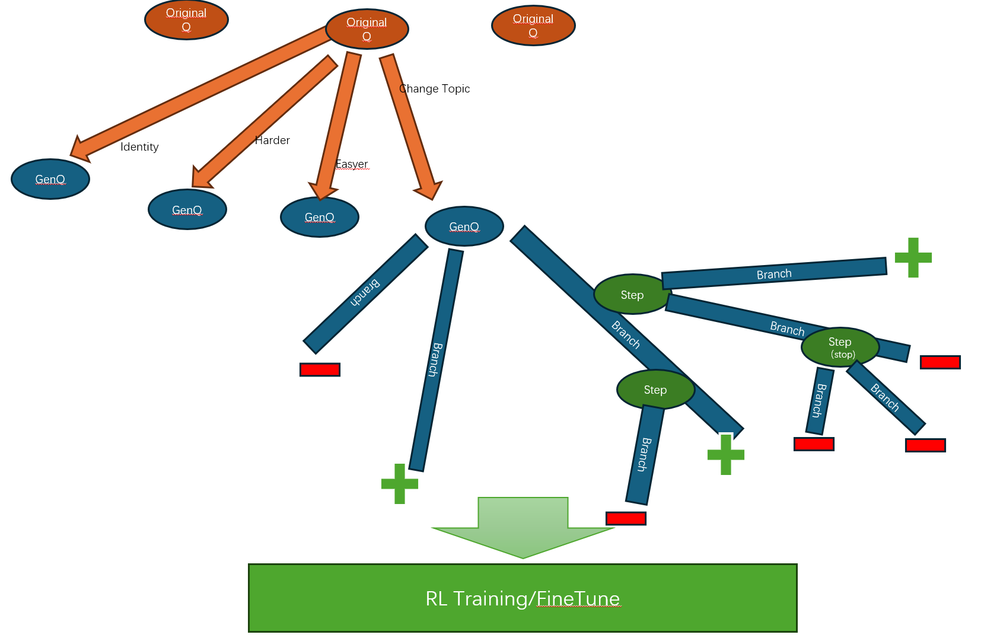

# Synthetic Data for Training Your Own O1

## Overview
The OpenAI o1 AI reasoning model represents a significant leap forward in artificial intelligence reasoning capabilities. This model stands out for its ability to outperform human experts in complex problem-solving scenarios, marking a crucial step towards Artificial General Intelligence (AGI). By employing sophisticated techniques like Chain of Thought prompting, the o1 model demonstrates critical thinking skills that elevate its performance beyond simple query-response interactions.

To train your own o1, you need to train a PRM(Process Reward Model) first. Then the PRM will guide the traing and inference of your own O1. Here is a method to generate datas which can be used to train a PRM. This method is based on the evolve-instruct, WizardMath, MCTS(Monte Carlo Tree Search).

How to improve your model's reasoning capability is another topic, and it is **coming soon。。。。**

## Implementation
This implementation is based on the [WizardLM](https://arxiv.org/abs/2304.12244), [h2o-wizardlm](https://github.com/h2oai/h2o-wizardlm), [Math-Shepherd](https://arxiv.org/abs/2312.08935) and [Verify Step By Step](https://arxiv.org/abs/2305.20050).

The process is: First, we generate more different questions base on the seed data using Evolve-Instruction; Then, we generate the 'Verify Step by Step' data to train PRM using a method similar to MCTS, which focus on generate more hard CoT in addition to right CoT.

Below image shows the process of our EvolveMCTS4RL method:


## How to create dataset
Example datasets are placed in this [folder](./samples). Please try the minimal example first and configure your dataset by referring to the tunable parameters.

Debug for test
```shell
chmod +x run_debug.sh
./run_debug.sh
```
### Tunable parameters
```python
parser.add_argument("--seed_file", type=str)
parser.add_argument("--column_names", default="problem")
parser.add_argument("--temperature", type=int, default=0.7)
parser.add_argument("--top_p", type=int, default=0.95)
parser.add_argument("--model_name", type=str, default="gpt-4o")
parser.add_argument("--num_branches", type=int, default=4)
parser.add_argument("--max_search", type=int, default=4)
parser.add_argument("--max_branches", type=int, default=40)
```

**Result example:**
[sythetic data saved as tree](./samples/math_500_tst.da85.json) ; [saved as flaten json](./samples/math_500_tst.564f.json)