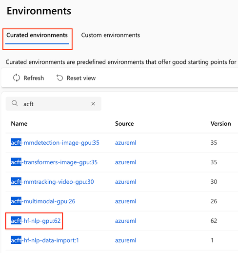
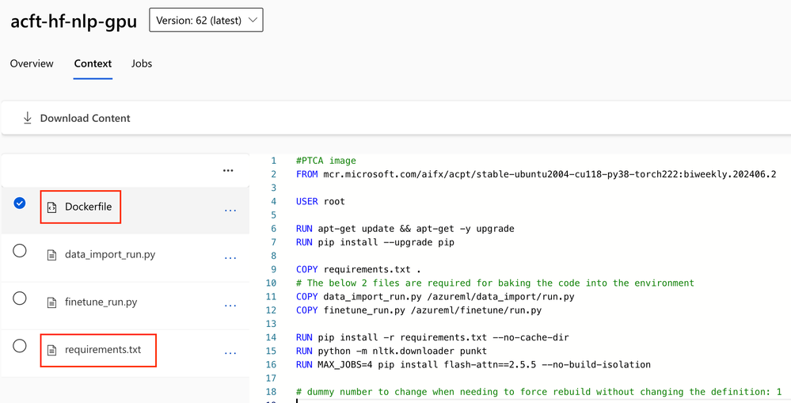
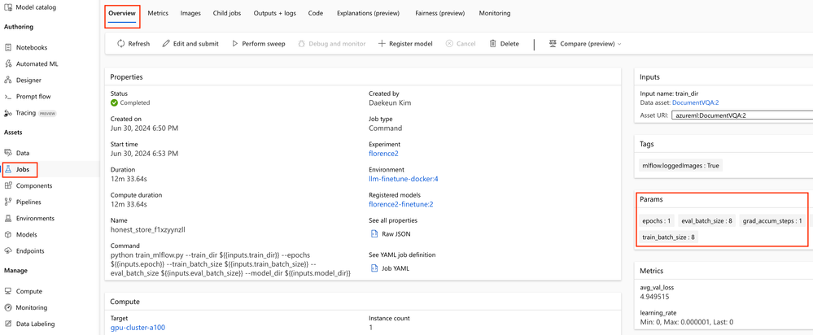
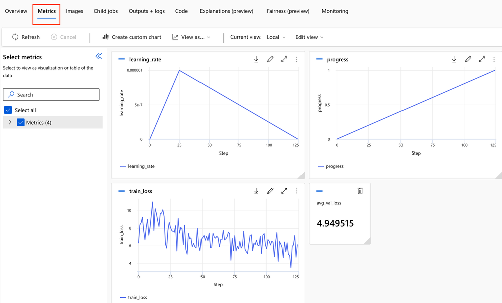
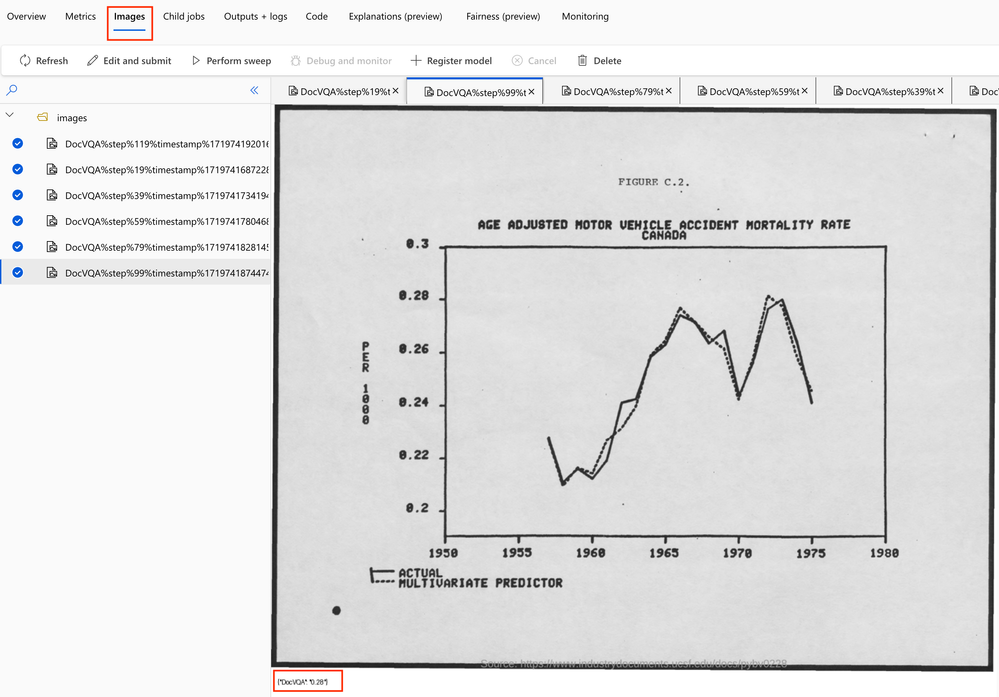
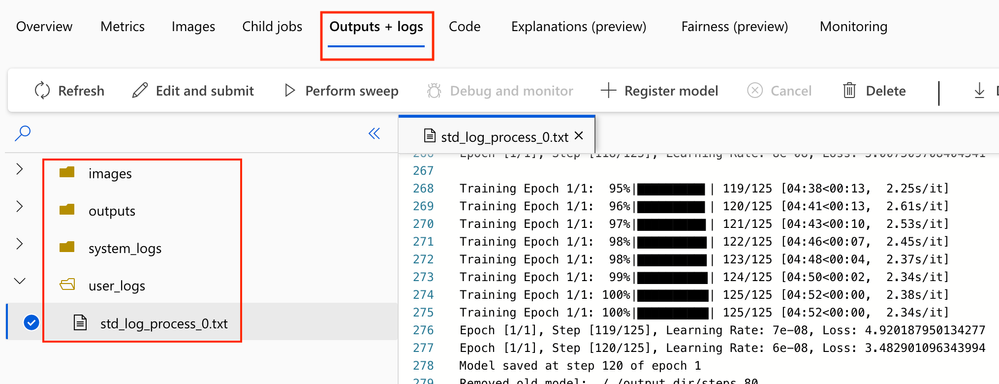

[English](README.md)

# Lab 2. SLM/LLM Fine-tuning on Azure ML Studio
{: .no_toc }

## 目次
{: .no_toc .text-delta }

1. 目次
{:目次}

---

## 1. 利用開始方法 
1. コンピューティング インスタンスを作成します。コード開発には、 `Standard_DS11_v2` (2 コア、14 GB RAM、28 GB ストレージ、GPU なし) をお勧めします。
2. CIのターミナルを開き、次のコマンドを実行します。 
    ```shell
    git clone https://github.com/Azure/slm-innovator-lab.git
    conda activate azureml_py310_sdkv2
    pip install -r requirements.txt
    ```
3. 目的のユースケースに使用するモデルを選択します。
    - [Phi-3、Phi-3.5](phi3)
        - [Option 1.MLフロー] それぞれ Run [`1_training_mlflow.ipynb`](phi3/1_training_mlflow.ipynb) と [`2_serving.ipynb`](phi3/2_serving.ipynb)を実行します。
        - [Option 2.Custom] それぞれ Run [`1_training_custom.ipynb`](phi3/1_training_custom.ipynb) と [`2_serving.ipynb`](phi3/2_serving.ipynb)を実行します。
        - *(オプション)* LLM データセットの前処理に関心がある場合は、フォルダ内のハンズオンを参照してください `phi3/dataset-preparation` 。
    - [Florence2-VQA](florence2-VQA)
        - それぞれ Run [`1_training_mlflow.ipynb`](florence2-VQA/1_training_mlflow.ipynb) と [`2_serving.ipynb`](florence2-VQA/2_serving.ipynb)を実行します。
    - `config.yml` を忘れずに編集してください。

## 2. Azure ML トレーニングの準備

### 2.1. 準備: Azure ML Python SDK v2

Azure ML Python SDK v2 は、コツをつかめば簡単に使用できます。AzureML を操作するための `MLClient` インスタンスが作成されると、アセットに対応する操作は `create_or_update function` を通して非同期に実行されます。以下のコードスニペットを参照してください。

```python
ml_client = MLClient.from_config(credential)

### 1. Training phase
# Create an environment asset
ml_client.environments.create_or_update(env_docker_image)

# Create a data asset
ml_client.data.create_or_update(data)

# Create a compute cluster
ml_client.compute.begin_create_or_update(compute)

# Start a training job
ml_client.jobs.create_or_update(job)

### 2. Serving phase
# Create a model asset
ml_client.models.create_or_update(run_model)

# Create an endpoint
ml_client.begin_create_or_update(endpoint)

# Create a deployment
ml_client.online_endpoints.begin_create_or_update(endpoint) 
```

### 2.2. データアセット

モデルのトレーニング/検証データセットは、直接ローカルにアップロードすることも、Azure ML ワークスペースのデータアセットとして登録することもできます。データ アセットを使用すると、データのバージョン管理が可能になり、データセットの変更を追跡し、必要に応じて以前のバージョンに戻すことができます。これにより、データ品質が維持され、データ解析の再現性が確保されます。

データ アセットは、Datastore に格納されているデータ ファイルまたはディレクトリを参照することによって作成されます。データストアは、外部データを格納する場所を表し、Azure Blob Storage、Azure File Share、Azure Data Lake Storage、OneLake などのさまざまな Azure データ ストレージ サービスに接続できます。Azure ML ワークスペースを作成すると、既定で 4 つのデータストア (`workspaceworkingdirectory`、 `workspaceartifactstore`、 `workspacefilestore`、`workspaceblobstore`) が自動的に作成されます。その中でも、workspaceblobstore は Azure Blob Storage であり、モデル トレーニング データや大きなファイルを格納するときに既定で使用されます。


### 2.3. 環境アセット

Azure ML は、コードが実行される環境アセットを定義します。組み込み環境を使用することも、Conda仕様またはDockerイメージを使用してカスタム環境を構築することもできます。CondaとDockerの長所と短所は次のとおりです。

**Conda 環境**

- 利点
    - 簡単な環境設定: Conda 環境ファイル (conda.yml) は、主に Python パッケージと Conda パッケージを指定するために使用されます。ファイル形式はシンプルで理解しやすく、パッケージやバージョン情報の指定に適しています。
    - クイック セットアップ: Conda 環境は依存関係を自動的に管理し、競合を解決するため、セットアップは比較的迅速かつ簡単です。
    - 軽量環境: Conda 環境は、特定のパッケージのみをインストールするため、Docker イメージよりも軽量になる可能性があります。
- 欠点
    - 柔軟性の制限: Conda 環境は Python パッケージと Conda パッケージに重点を置いているため、より複雑なシステムレベルの依存関係を処理することは困難です。
    - 移植性の制限: Conda 環境は主に Python パッケージと Conda パッケージで構成されているため、他の言語やより複雑なシステム コンポーネントを含めることは困難です。

**Docker環境**

- 利点
    - 高い柔軟性: Docker を使用すると、オペレーティング システム レベルから始めて、必要なすべてのパッケージとツールを含む完全な環境を定義できます。システムの依存関係、カスタム設定、Python以外のパッケージなどが含まれる場合があります。
    - 移植性: Docker イメージはどこでも同じように実行されるため、環境の一貫性が確保されます。これにより、再現性と携帯性が大幅に向上します。
    - 複雑な環境のセットアップ: Docker を使用すると、複雑なアプリケーションや複数のサービスを含む環境をセットアップできます。
- 欠点
    - 複雑なセットアップ: Docker イメージの構築と管理は、Conda 環境のセットアップよりも複雑になる場合があります。Dockerfile を記述し、必要なすべての依存関係を含める必要があります。
    - ビルド時間: 初めて Docker イメージをビルドするには、特に依存関係のインストール プロセスが複雑な場合、時間がかかることがあります。

Azure ML では、プロジェクトの要件に基づいて適切な方法を選択することが重要です。単純な Python プロジェクトの場合は Conda 環境で十分な場合がありますが、複雑なシステム依存関係が必要な場合は、Docker 環境の方が適している可能性があります。カスタム Docker イメージを作成する最も簡単で最速の方法は、キュレーションされた環境に小さな変更を加えることです。以下はその一例です。

Azure ML 環境の キュレーションされた環境 タブから `acft-hf-nlp-gpu` を選択してください(もちろん、別の環境を選択することもできます)。



`Dockerfile` と `requirements.txt` をコピーして、必要に応じて変更してください。



以下のコード スニペットは、 `Dockerfile` の編集例です。

```Dockerfile
FROM mcr.microsoft.com/aifx/acpt/stable-ubuntu2004-cu118-py38-torch222:biweekly.202406.2

USER root

RUN apt-get update && apt-get -y upgrade
RUN pip install --upgrade pip

COPY requirements.txt .
RUN pip install -r requirements.txt --no-cache-dir

RUN python -m nltk.downloader punkt
RUN MAX_JOBS=4 pip install flash-attn==2.5.9.post1 --no-build-isolation
```

## 3. Azure ML トレーニング

### 3.1. MLflow を使用したトレーニングスクリプト

一部の人々は、既存のトレーニングスクリプトに大幅な変更を加える必要がある、またはMlflowツールキットが必須であると考えるかもしれませんが、これは真実ではありません。既存のトレーニング環境に慣れている場合は、Mlflow を採用する必要はありません。それにもかかわらず、MlflowはAzure MLでのモデルのトレーニングとデプロイを非常に便利にするツールキットであるため、この章で簡単に説明します。


トレーニング スクリプトで、 MLflow で実験を開始するには `mlflow.start_run()` 、終了時に実験を終了するには `mlflow.end_run()` 使用します。構文でラップすると、明示的に end_run() を呼び出す必要がなくなります。mlflow ブロック内では mlflow ログを実行できます。今回のトレーニング スクリプトでは `mlflow.log_params()`、`mlflow.log_metric()`、 `mlflow.log_image()` を使用します。詳しくは[こちらをご覧ください](https://learn.microsoft.com/en-us/azure/machine-learning/how-to-log-view-metrics?view=azureml-api-2&tabs=interactive)。

```python
import mlflow
...
with mlflow.start_run() as run:
  mlflow.log_params({
    "epochs": epochs,
    "train_batch_size": args.train_batch_size,
    "eval_batch_size": args.eval_batch_size,
    "seed": args.seed,
    "lr_scheduler_type": args.lr_scheduler_type,        
    "grad_accum_steps": grad_accum_steps, 
    "num_training_steps": num_training_steps,
    "num_warmup_steps": num_warmup_steps,
  })    
    
  # Your training code
  for epoch in range(epochs):     
    train_loss = 0.0
    optimizer.zero_grad()

    for step, (inputs, answers) in enumerate(tqdm(train_loader, desc=f"Training Epoch {epoch + 1}/{epochs}")):    
      ...
      mlflow.log_metric("train_loss", train_loss)
      mlflow.log_metric("learning_rate", learning_rate)
      mlflow.log_metric("progress", progress)
      ...
      if (step + 1) % save_steps == 0:
        # Log image
        idx = random.randrange(len(val_dataset))
        val_img = val_dataset[idx][-1]
        result = run_example("DocVQA", 'What do you see in this image?', val_dataset[idx][-1])
        val_img_result = create_image_with_text(val_img, json.dumps(result))
        mlflow.log_image(val_img_result, key="DocVQA", step=step)    
```

{: .warning}
一部の SLM/LLM は `mlflow.transformers.log_model()` をサポートしていないため、従来の `save_pretrained()` を用いてモデルを保存することをお勧めします。

```python
model.save_pretrained(model_dir)
processor.save_pretrained(model_dir)
```

### 3.2. コンピューティングクラスターとトレーニングジョブの作成

トレーニングスクリプトの記述とデバッグが完了したら、トレーニングジョブを作成できます。基本的には、NVIDIA A100 GPUを1台搭載した `Standard_NC24ads_A100_v4` をご使用いただけます。2024 年 9 月の米国東部リージョンでの LowPriority VM のプロビジョニングのコストは、1 時間あたりわずか $0.74 です。

この `command()` 関数は、トレーニング タスクの定義と実行に使用される Azure ML のメイン関数の 1 つです。この関数は、トレーニング スクリプトとその必要な環境設定を指定し、Azure ML のコンピューティング リソースでジョブを実行できるようにします。

```python
from azure.ai.ml import command
from azure.ai.ml import Input
from azure.ai.ml.entities import ResourceConfiguration

job = command(
    inputs=dict(
        #train_dir=Input(type="uri_folder", path=DATA_DIR), # Get data from local path
        train_dir=Input(path=f"{AZURE_DATA_NAME}@latest"),  # Get data from Data asset
        epoch=d['train']['epoch'],
        train_batch_size=d['train']['train_batch_size'],
        eval_batch_size=d['train']['eval_batch_size'],  
        model_dir=d['train']['model_dir']
    ),
    code="./src_train",  # local path where the code is stored
    compute=azure_compute_cluster_name,
    command="python train_mlflow.py --train_dir ${{inputs.train_dir}} --epochs ${{inputs.epoch}} --train_batch_size ${{inputs.train_batch_size}} --eval_batch_size ${{inputs.eval_batch_size}} --model_dir ${{inputs.model_dir}}",
    #environment="azureml://registries/azureml/environments/acft-hf-nlp-gpu/versions/61", # Use built-in Environment asset
    environment=f"{azure_env_name}@latest",
    distribution={
        "type": "PyTorch",
        "process_count_per_instance": 1, # For multi-gpu training set this to an integer value more than 1
    },
)
returned_job = ml_client.jobs.create_or_update(job)
ml_client.jobs.stream(returned_job.name)
```

### 3.3. トレーニングジョブを確認する

Jobs Assetを通じて、モデルの学習が正常に進行しているか確認します。

1. **「概要**」タブでは、全体的なトレーニング履歴を表示できます。パラメータ は、` mlflow.log_params()`トレーニング スクリプトに登録されているパラメータです。



2. **「メトリクス」**タブでは、登録したメトリクスを `mlflow.log_metric()` 一目で確認することができます。



3. **[画像** ] タブでは、. `mlflow.log_image()`推論結果を画像として保存して、モデルの学習が順調に進んでいるかどうかを確認することをお勧めします。



4. **[出力 + ログ**] タブでは、モデル トレーニング インフラストラクチャ、コンテナー、およびコードの問題を確認および監視します。
    - `system_logs` フォルダーには、トレーニングクラスター、データアセット、ホストツールなどに関連するすべての主要なアクティビティとイベントが記録されます。
    - `user_logs` フォルダは主に、トレーニングスクリプト内でユーザーが作成したログやその他のファイルを保存する上で重要な役割を果たし、トレーニングプロセスの透明性を高め、デバッグと監視を容易にします。これにより、ユーザーはトレーニングプロセスの詳細な記録を確認し、必要に応じて問題を特定して解決できます。



## 4. Azure ML の提供
モデルのトレーニングが完了したら、ホスティング サーバーにデプロイしましょう。MLflowの `log_model()` で保存した場合は  Mlflowで直接デプロイできますが、今回のトランスフォーマー と mlflow バージョンでは、モデルを保存する従来の方法を使用したため、カスタムオプションを使用してデプロイする必要があります。

### 4.1. 推論スクリプト

2つの関数 `init()` と `run()` を定義し自由に書くだけです。init() 関数に直接引数を渡すことはできませんが、初期化中に環境変数または設定ファイルを通じて必要な情報を渡すことができます。

### 4.2. モデルの登録

`azure.ai.ml.entities` の Model クラスで設定します。`ml_client.models.create_or_update()` で設定して使用するときにモデルのパスと名前を入力します。

```python
def get_or_create_model_asset(ml_client, model_name, job_name, model_dir="outputs", model_type="custom_model", update=False):
    
    try:
        latest_model_version = max([int(m.version) for m in ml_client.models.list(name=model_name)])
        if update:
            raise ResourceExistsError('Found Model asset, but will update the Model.')
        else:
            model_asset = ml_client.models.get(name=model_name, version=latest_model_version)
            print(f"Found Model asset: {model_name}. Will not create again")
    except (ResourceNotFoundError, ResourceExistsError) as e:
        print(f"Exception: {e}")        
        model_path = f"azureml://jobs/{job_name}/outputs/artifacts/paths/{model_dir}/"    
        run_model = Model(
            name=model_name,        
            path=model_path,
            description="Model created from run.",
            type=model_type # mlflow_model, custom_model, triton_model
        )
        model_asset = ml_client.models.create_or_update(run_model)
        print(f"Created Model asset: {model_name}")

    return model_asset
```

### 4.3. 環境アセット

これは、前のセクションで紹介した環境アセットと同じです。ただし、モデルサービングにはウェブホスティングの追加設定が必要なため、以下のコードスニペットの内容を設定します。

```Dockerfile
FROM mcr.microsoft.com/aifx/acpt/stable-ubuntu2004-cu118-py38-torch222:biweekly.202406.2

# Install pip dependencies
COPY requirements.txt .
RUN pip install -r requirements.txt --no-cache-dir

RUN MAX_JOBS=4 pip install flash-attn==2.5.9.post1 --no-build-isolation

# Inference requirements
COPY --from=mcr.microsoft.com/azureml/o16n-base/python-assets:20230419.v1 /artifacts /var/
RUN /var/requirements/install_system_requirements.sh && \\
    cp /var/configuration/rsyslog.conf /etc/rsyslog.conf && \\
    cp /var/configuration/nginx.conf /etc/nginx/sites-available/app && \\
    ln -sf /etc/nginx/sites-available/app /etc/nginx/sites-enabled/app && \\
    rm -f /etc/nginx/sites-enabled/default
ENV SVDIR=/var/runit
ENV WORKER_TIMEOUT=400
EXPOSE 5001 8883 8888

# support Deepspeed launcher requirement of passwordless ssh login
RUN apt-get update
RUN apt-get install -y openssh-server openssh-client
```

### 4.4. エンドポイントの作成

エンドポイントとは、モデルを外部からアクセス可能にする HTTP(S) URL を指します。エンドポイントは複数のデプロイメントを持つことができるため、トラフィックを複数のデプロイメントに分散できます。エンドポイントは、次のことを行います。

- **提供されるAPIインターフェース**:エンドポイントは、RESTful APIを介してモデル予測リクエストを受信するためのURLを提供します。
- **トラフィック ルーティング**: エンドポイントは、トラフィックを複数のデプロイに分散します。これにより、A/B テストまたはカナリア デプロイ戦略を実装できます。
- **スケーラビリティ**: エンドポイントは、複数のデプロイ間でのスケーリングをサポートし、トラフィックの増加に応じて追加のデプロイ間で負荷分散できます。
- **セキュリティ管理**: エンドポイントは、認証と承認を通じてモデルを保護します。API キーまたは Microsoft Entra ID を使用してアクセスを制御できます。

コード スニペットを次に示します。このプロセスでは、まだコンピューティングクラスターがプロビジョニングされないことに注意してください。

```python
from azure.ai.ml.entities import (
    ManagedOnlineEndpoint,
    IdentityConfiguration,
    ManagedIdentityConfiguration,
)

# Check if the endpoint already exists in the workspace
try:
    endpoint = ml_client.online_endpoints.get(azure_endpoint_name)
    print("---Endpoint already exists---")
except:
    # Create an online endpoint if it doesn't exist
    endpoint = ManagedOnlineEndpoint(
        name=azure_endpoint_name,
        description=f"Test endpoint for {model.name}",
    )

# Trigger the endpoint creation
try:
    ml_client.begin_create_or_update(endpoint).wait()
    print("\\n---Endpoint created successfully---\\n")
except Exception as err:
    raise RuntimeError(
        f"Endpoint creation failed. Detailed Response:\\n{err}"
    ) from err
```

### 4.5. デプロイメントの作成

デプロイは、モデルを実際に実行するインスタンスです。複数のデプロイをエンドポイントに接続でき、各デプロイにはモデル、環境、コンピューティング リソース、インフラストラクチャ設定などが含まれます。デプロイメントでは、次の処理が行われます。

- **リソースの管理**: デプロイでは、モデルの実行に必要なコンピューティング リソースが管理されます。CPU、GPU、メモリなどのリソースを設定できます。
- **バージョン管理**: デプロイでは、モデルのさまざまなバージョンを管理できます。これにより、以前のバージョンにロールバックしたり、新しいバージョンをデプロイしたりすることが容易になります。
- **監視とロギング**:実行中のモデルのログとパフォーマンスを監視できます。これにより、問題を検出して解決できます。

コード スニペットを次に示します。GPU クラスターをプロビジョニングし、サービス環境を構築する必要があるため、これには多くの時間がかかることに注意してください。

```python
from azure.ai.ml.entities import (    
    OnlineRequestSettings,
    CodeConfiguration,
    ManagedOnlineDeployment,
    ProbeSettings,
    Environment
)

deployment = ManagedOnlineDeployment(
    name=azure_deployment_name,
    endpoint_name=azure_endpoint_name,
    model=model,
    instance_type=azure_serving_cluster_size,
    instance_count=1,
    #code_configuration=code_configuration,
    environment = env,
    scoring_script="score.py",
    code_path="./src_serve",
    #environment_variables=deployment_env_vars,
    request_settings=OnlineRequestSettings(max_concurrent_requests_per_instance=3,
                                           request_timeout_ms=90000, max_queue_wait_ms=60000),
    liveness_probe=ProbeSettings(
        failure_threshold=30,
        success_threshold=1,
        period=100,
        initial_delay=500,
    ),
    readiness_probe=ProbeSettings(
        failure_threshold=30,
        success_threshold=1,
        period=100,
        initial_delay=500,
    ),
)

# Trigger the deployment creation
try:
    ml_client.begin_create_or_update(deployment).wait()
    print("\\n---Deployment created successfully---\\n")
except Exception as err:
    raise RuntimeError(
        f"Deployment creation failed. Detailed Response:\\n{err}"
    ) from err
    
endpoint.traffic = {azure_deployment_name: 100}
endpoint_poller = ml_client.online_endpoints.begin_create_or_update(endpoint)   
```

{: .note}
liveness probe の設定を直接指定してデプロイし、モデルデプロイコンテナが正常に動作しているか確認してください。デバッグ時には、高いinitial_delayと高いfailure_threshold、高頻度のエラー ログ分析を設定することをお勧めします。上記の設定については、 `ProbeSettings()` のコードを確認してください。