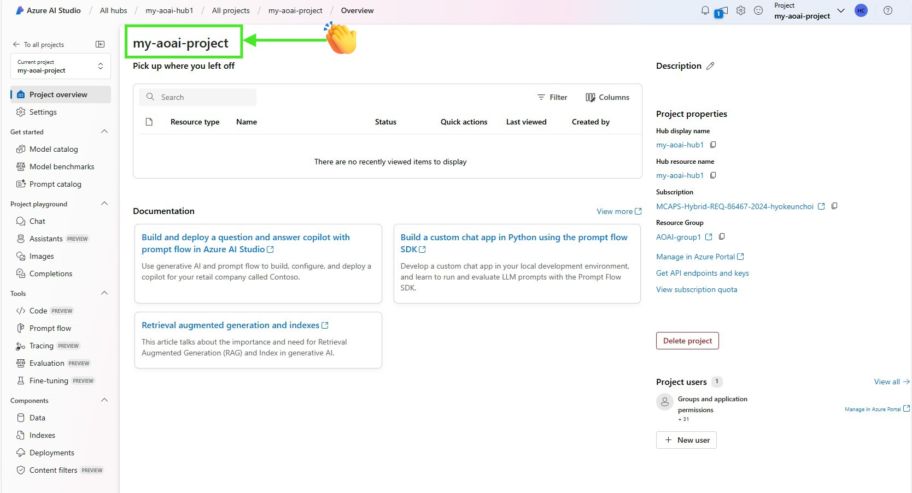
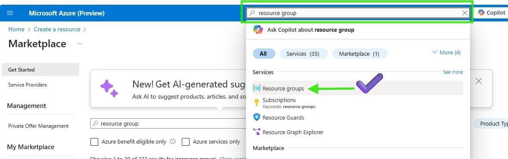
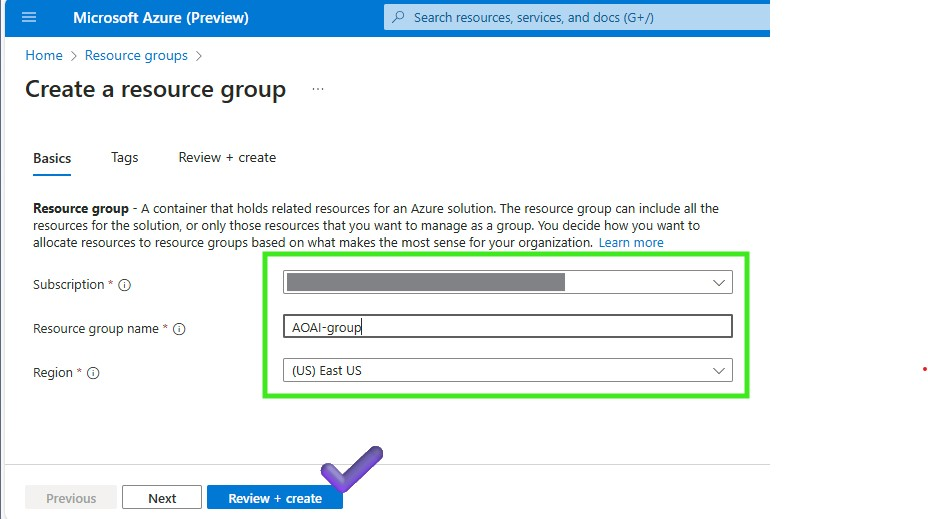
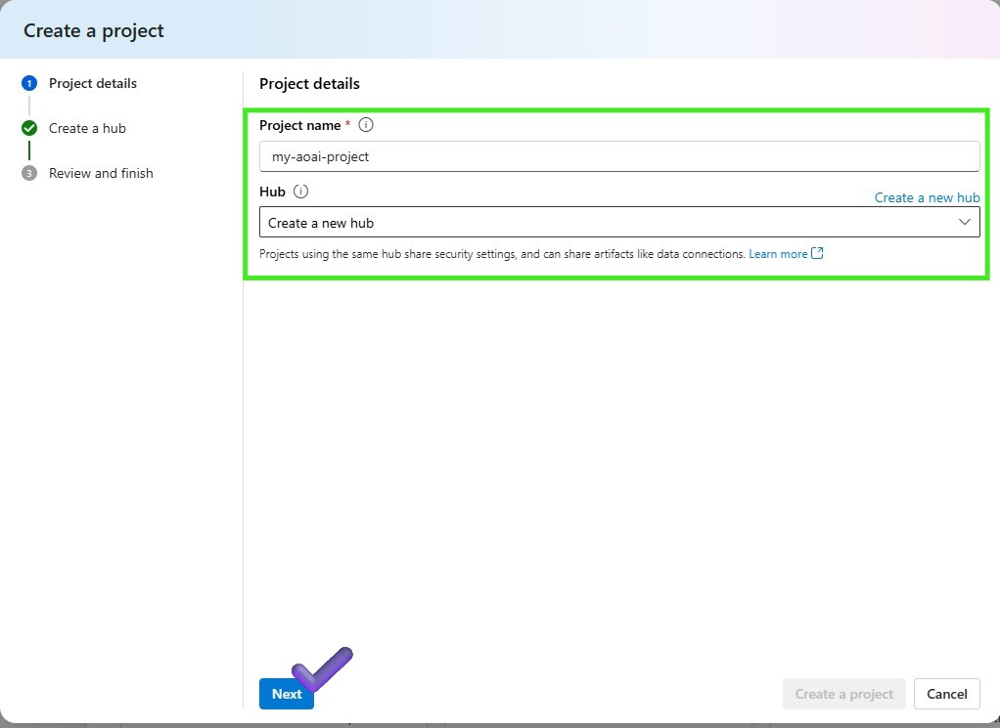
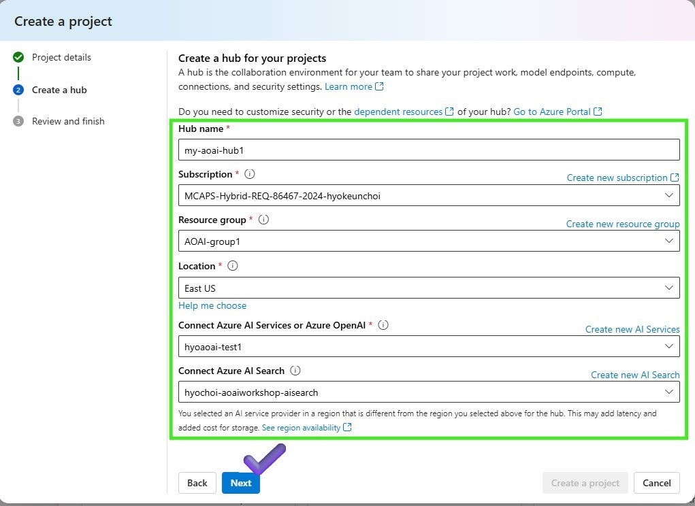
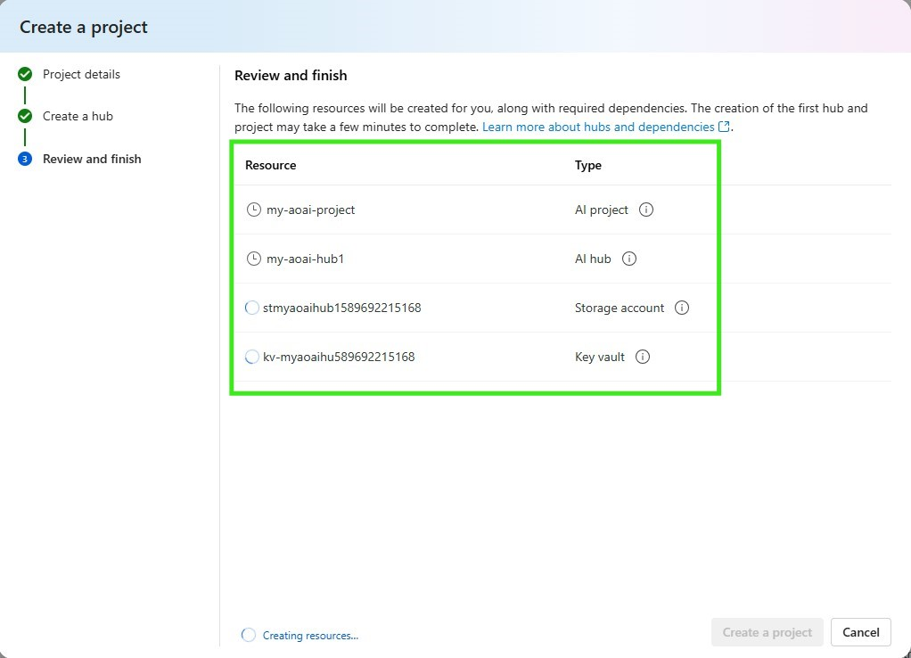

# Lab 3.1 Scenario 1: Set Up Azure AI Studio for LLMOps

## Overview
In this lab, we will learn how to set up Azure AI studio with Prompt flow for your LLMOps. 

[no-code, 10min]

### Result

### Prerequisites
An Azure subscription is required, where you can create an AI Project along with its AI Hub Resource, Prompt flow, a Content Safety service, deployed fine-tuned model endpoint and an AI Search service.

### Steps
    0️⃣ Create the Azure Resource Group  
    1️⃣ Create Azure AI project in Azure AI Studio
    2️⃣ Create a compute instance to run Prompt flow
    🗑️ Clean up resources

You can use compute instance as your dev box, learn more here: Get started with Azure AI projects in VS Code (Web)
We also provide VS code extension to help you develop prompt flow, learn more here: Prompt flow for VS Code

### 0️⃣ Create the Azure Resource Group 
1. Open the Azure portal and select resource groups
     

1. Select Create and Enter the following values:
- Subscription: Select your Azure subscription.
- Resource group: Enter a new resource group name.
- Region: Select an Azure location, such as Central US.  
     

3. Enter the following values:
- Subscription: Select your Azure subscription.
- Resource group: Enter a new resource group name.
- Region: Select an Azure location, such as Central US.    

### 1️⃣ Create an Azure AI project in Azure AI Studio
1. Go to the [Home page of Azure AI Studio](https://ai.azure.com/) 
2. Select + new project
3. Enter a name for the project and select a hub from the dropdown to host your project. If you don't have access to a hub yet, select Create a new hub.
     

4. In order to create a hub, enter the subscription, resource group already made, Location and select or create an Azure Open AI resource
     

5. On the Review and finish page, you see the resources will be created. It my take a few minutes to complete.
     

### 2️⃣ Create a compute instance to run Prompt flow
1. Once finishing to create Azure Open AI project, you will see the screen below
    
- Option1-1: Azure Machine Learning -> Prompt flow -> Start compute session  
- Option1-2: Azure Machine Learning -> Compute Instances -> Launch VS Code 
- Option2-1: Azure AI Studio -> Prompt flow -> Start compute session
- Option2-2: Azure AI Studio -> Code -> Create new compute -> VS Code container -> Launch VS Code
- Option3-1: CodeSpaces -> Prompt flow -> Start compute

Serverless compute sessions offer cost-effectiveness, scalability, reduced management overhead, and quick setup, but come with drawbacks like limited control and cold start latency. On the other hand, VS code extension for prompt flow provides customization, consistency, and flexibility, but can incur higher costs, require more management effort, and take longer to set up.

### 🗑️ Clean up resources
1. Go to the [Azure portal](https://portal.azure.com/) and select Resource groups
2. Select the resource group you created for this lab
3. Select Delete resource group
4. Enter the resource group name and select Delete

