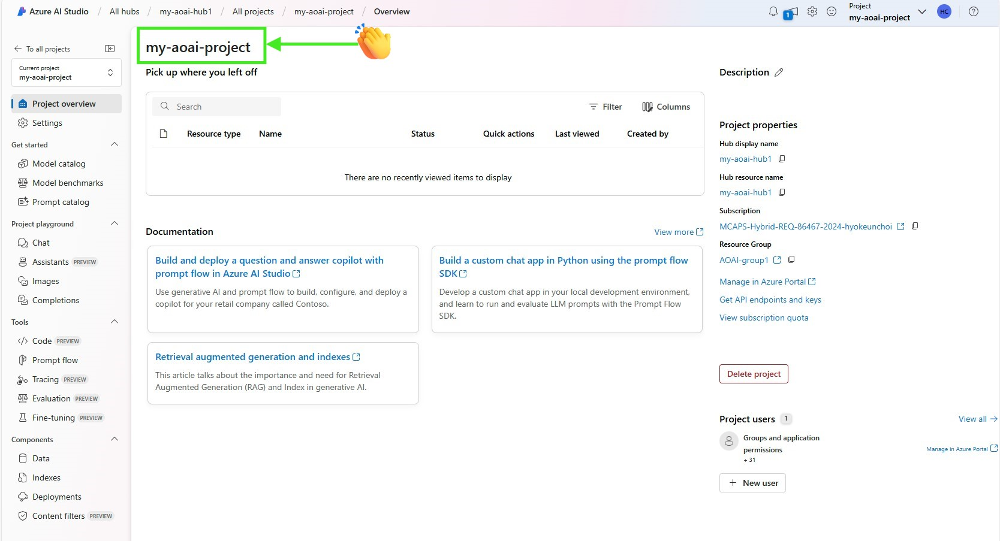
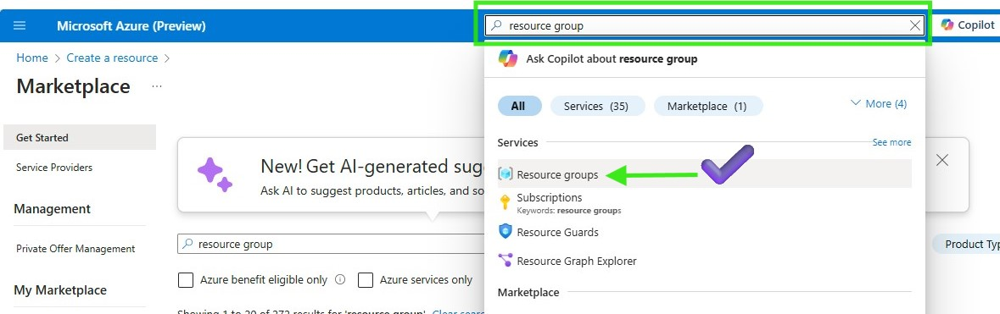
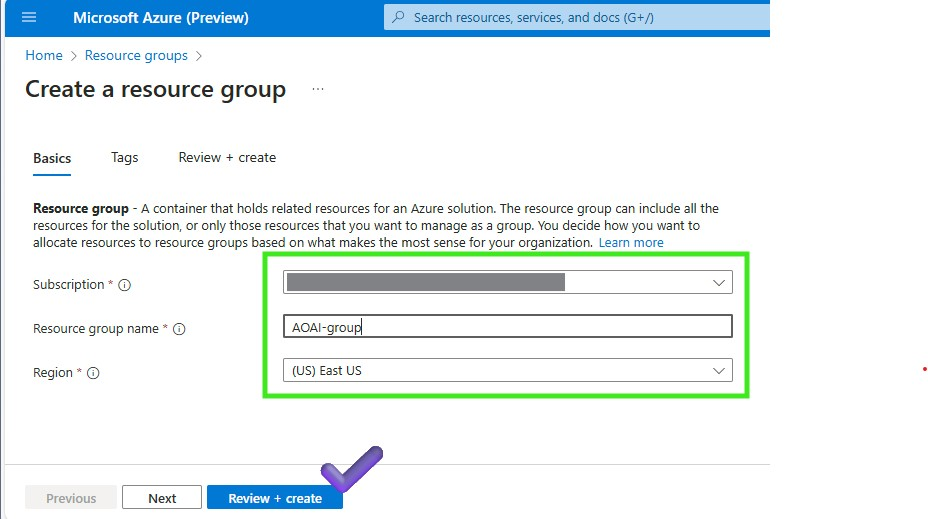
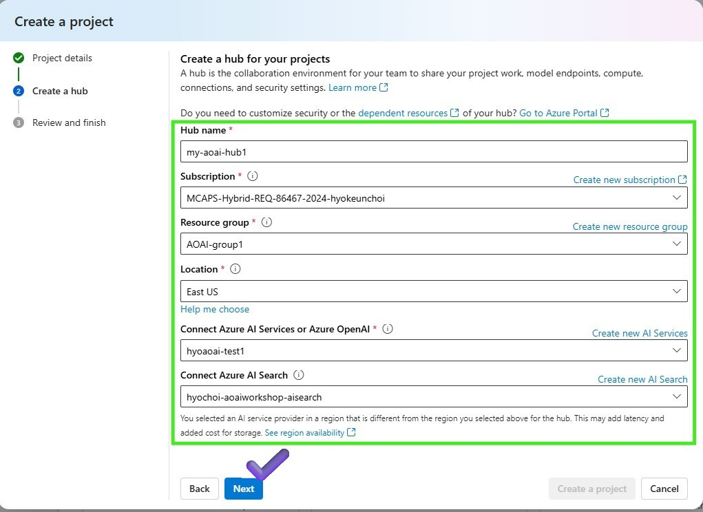

[English](README.md)

# Lab 3.1 Scenario 1: Set Up Azure AI Studio for LLMOps

## 概要
このラボでは、LLMOps のプロンプト フローを使用して Azure AI Studio を設定する方法について説明します。 

[ノーコード、10分]

### 結果

### 前提 条件
AI Hub リソース、プロンプト フロー、Content Safety サービス、デプロイされた微調整されたモデル エンドポイント、AI Search サービスと共に AI プロジェクトを作成できる Azure サブスクリプションが必要です。

### 手順
    0️⃣ Azureリソースグループの作成   
    1️⃣ Azure AI Studio で Azure AI プロジェクトを作成する
    2️⃣ プロンプトフローを実行するコンピューティング インスタンスを作成する
    🗑️ リソースをクリーンアップする

コンピューティング インスタンスを開発ボックスとして使用することができる場合は、VS Code で Azure AI プロジェクトを開始する (Web) を参照してください。
また、プロンプト フローの開発に役立つ VS Code 拡張機能も提供しています。詳細については、VS Code のプロンプト フローを参照してください。

### 0️⃣ Azureリソースグループの作成 
1. Azure portal を開き、リソース グループを選択します
     Azure portal でリソース グループを検索する

1. [作成] を選択し、次の値を入力します。
- サブスクリプション: Azure サブスクリプションを選択します。
- リソース グループ: 新しいリソース グループ名を入力します。
- リージョン: Azure の場所 (米国中部など) を選択します。 
    を作成する

3. 次の値を入力します。
- サブスクリプション: Azure サブスクリプションを選択します。
- リソース グループ: 新しいリソース グループ名を入力します。
- リージョン: Azure の場所 (米国中部など) を選択します。    

### 1️⃣ Azure AI Studio で Azure AI プロジェクトを作成する
1. Azure AI Studio[  のホーム ページ](https://ai.azure.com/)に移動します 
2. [+ 新しいプロジェクト] を選択します
3. プロジェクトの名前を入力し、ドロップダウンからハブを選択してプロジェクトをホストします。ハブへのアクセス権がまだない場合は、 [新しいハブの作成] を選択します。
    の作成

4. ハブを作成するには、サブスクリプション、既に作成されているリソース グループ、場所を入力し、Azure Open AI リソースを選択または作成します
    を作成する

5. [レビューと完了] ページに、リソースが作成されることが表示されます。完了するまでに数分かかります。
    を作成する

### 2️⃣ プロンプトフローを実行するコンピューティング インスタンスを作成する
1. Azure Open AI プロジェクトの作成が完了すると、次の画面が表示されます
    
- オプション 1-1: Azure Machine Learning -> プロンプト フロー -> コンピューティング セッションを開始する  
- オプション 1-2: Azure Machine Learning > コンピューティング インスタンス > VS Code の起動 
- オプション 2-1: Azure AI Studio -> プロンプト フロー -> コンピューティング セッションの開始
- オプション 2-2: Azure AI Studio -> コード -> 新しいコンピューティングの作成 -> VS Code コンテナー -> VS Code の起動
- オプション 3-1: CodeSpaces > プロンプト フロー -> コンピューティングの開始

サーバーレス コンピューティング セッションは、費用対効果、スケーラビリティ、管理オーバーヘッドの削減、迅速なセットアップを提供しますが、制御の制限やコールド スタートの遅延などの欠点があります。一方、プロンプト フロー用の VS Code 拡張機能は、カスタマイズ、一貫性、柔軟性を提供しますが、コストが高くなり、管理作業が増え、セットアップに時間がかかる可能性があります。

### ️リソースをクリーンアップする
1. Azure portal[ に移動し ](https://portal.azure.com/) 、 [リソース グループ] を選択します
2. このラボ用に作成したリソース グループを選択します
3. [リソース グループの削除] を選択します
4. リソース グループ名を入力し、 [削除] を選択します

