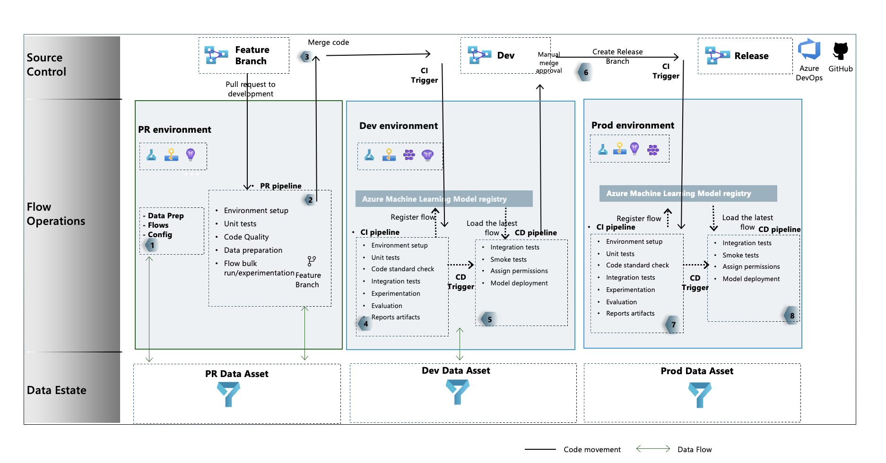

# Lab 3.2 Scenario 2: Basic LLMOps for your first gen AI application

## Overview
In this lab, we will learn how to create your basic ochestration flow and automate the build and deployment of your LLMOps flow

### Result

### TOC
- 0️⃣ Create a standard flow 
- 1️⃣ Integrate the phi3 endpoint into Python Node 
- 🧪 Test the Flow locally
- 2️⃣ Deploy your flow for real-time inference
- 3️⃣ Build basic LLMOps pipeline using Github Actions
- 4️⃣ Build advanced LLMOps pipeline for dev, production
- 🗑️ Clean up resources

For simplicity, we will only go up to step 5 of the diagram at the result figure in this page

### 0️⃣ Create a standard flow 
- 
- 
- 

### 1️⃣ Integrate the phi3 endpoint into Python Node 
- 
- 

### 🧪 Test the Flow locally
- 
- 

### 2️⃣ Deploy your flow for real-time inference
- 
- 

### 3️⃣ Build basic LLMOps pipeline using Github Actions
- 
- 
- 

### 🗑️ Clean up resources

https://learn.microsoft.com/en-us/azure/ai-studio/how-to/flow-deploy 