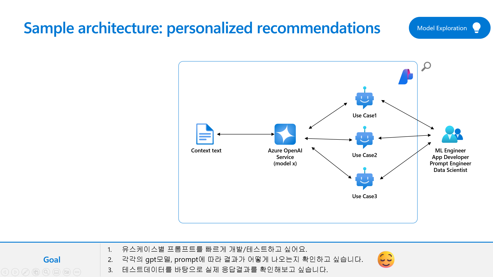

# Lab1 Explore your model and prompt with Prompt Flow

## Overview
In this lab, you will explore your model in Azure AI studio and conduct A/B testing with your LLM nodes to evaluate the performance of prompt and LLM. You will learn how to create your variants which can help you test the model’s behavior under different conditions, such as different wording, formatting, context, temperature, or top-k, compare and find the best prompt and configuration that maximizes the model’s accuracy, diversity, or coherence.

### Prerequisites

An Azure subscription where you can create an AI Hub and AI project Resource.

### Task

- 유스케이스별 프롬프트를 빠르게 개발/테스트하고 싶어요. 
- 각각의 gpt모델, prompt에 따라 결과가 어떻게 나오는지 확인하고 싶습니다. 
- 테스트데이터를 바탕으로 실제 응답결과를 확인해보고 싶습니다. 

### TOC
- 1️⃣ Create a chat flow 
- 2️⃣ Custom evaluation (batch run)
- 3️⃣ Create variants to define the right model
- 4️⃣ Manual evauations to build a math assistant 

### 1️⃣ Create a chat flow 
- 

### 2️⃣ Custom evaluation (batch run)
- 
- 

### 3️⃣ Create variants to define the right model
- 

### 4️⃣ Manual evauations to build a math assistant 

### 🧪 Hands-on
### 🗑️ Clean up resources

https://learn.microsoft.com/en-us/azure/ai-studio/how-to/flow-deploy 