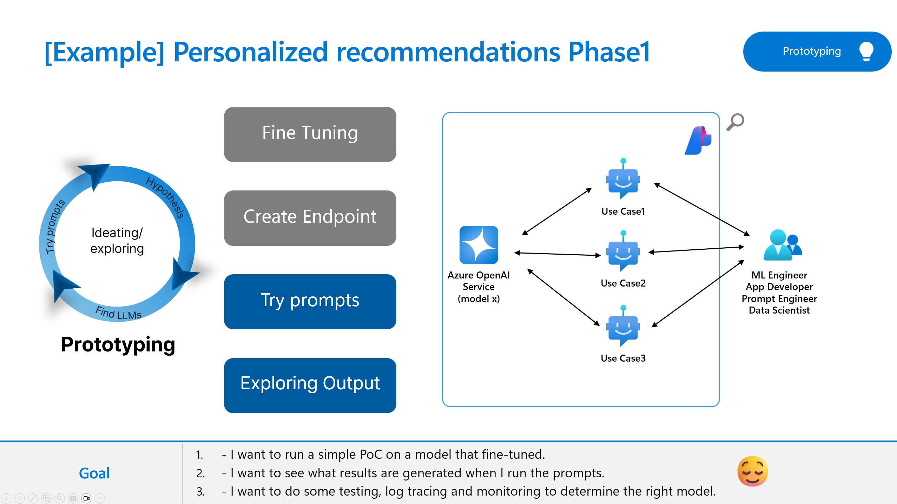

[日本語](README_ja.md)

# Lab 3.2 Scenario 1: Prototype your first gen AI application with prompt flow

## Overview
In this lab, we will learn how to utilize Prompt flow to prototype your generative AI application. Azure AI studio with Prompt flow help you ideate and explore LLMs to convince your specific use cases. 

### 🥇Other Resources
Here are the reference architectures, best practices and guidances on this topic. Please refer to the resources below. 

- https://learn.microsoft.com/en-us/azure/machine-learning/prompt-flow/how-to-end-to-end-llmops-with-prompt-flow?view=azureml-api-2
- https://github.com/microsoft/llmops-promptflow-template
