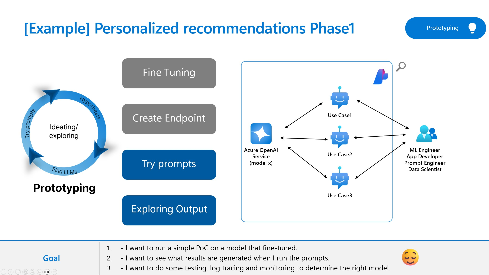

[English](README.md)

# Lab 3.2 Scenario 1: Prototype your first gen AI application with prompt flow

## 概要
このラボでは、Prompt フローを使用して生成 AI アプリケーションのプロトタイプを作成する方法を学習します。プロンプト フローを備えた Azure AI Studio は、LLM のアイデアを作成して探索し、特定のユース ケースを説得するのに役立ちます。 

### その他のリソース
ここでは、このトピックに関するリファレンスアーキテクチャ、ベストプラクティス、およびガイダンスを示します。以下のリソースを参照してください。 

- https://learn.microsoft.com/en-us/azure/machine-learning/prompt-flow/how-to-end-to-end-llmops-with-prompt-flow?view=azureml-api-2
- https://github.com/microsoft/llmops-promptflow-template
