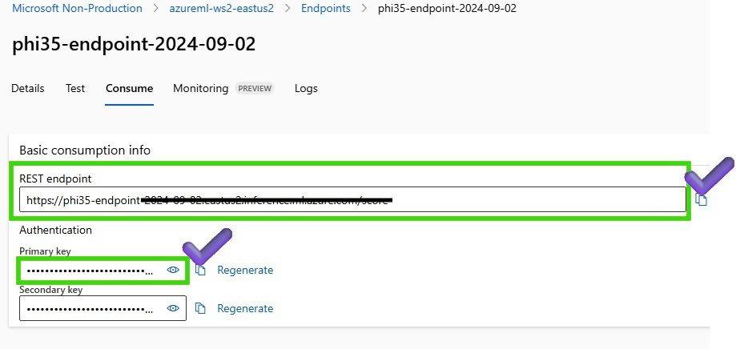
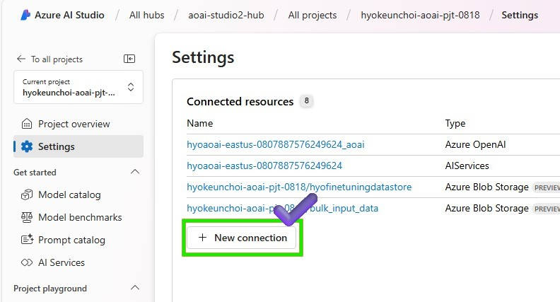
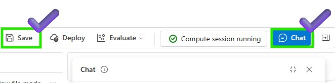

# Lab 3.2.1 Prototyping a Gen AI app using the fine-tuned model with Azure AI Studio Prompt Flow

### Prerequisites

- An Azure subscription where you can create an AI Hub and AI project Resource.
- Online endpoint of the fine-tuned model in Azure ML Studio
- Deployed gpt-4o model in Azure AI Studio 


### Task

- I want to run a simple PoC on a model that fine-tuned. 
- I want to see what results are generated when I run the prompts. 

### TOC
    1️⃣ Create a basic chat flow 
    2️⃣ Integrate the fine-tuned phi3.5 endpoint into Python Node

### 1️⃣ Create a basic chat flow 

Define the Chat Flow: Create a new chat flow and define the chat flow structure

1. Azure AI Studio > Prompt flow > Click +Create to create a new flow


2. In order to get a user-friendly chat interface, select Chat flow


3. Put your folder name to store your Promptflow files and click the Create button


4. Change as raw file model to modify your basic chat flow


5. Modify flow.dag.yaml and define the new chat flow structure. You can also refer the source code below. 


```
inputs:
  question:
    type: string
    is_chat_input: true
outputs:
  answer:
    type: string
    reference: ${phi35.output}
    is_chat_output: true
nodes:
- name: phi35
  type: python
  source:
    type: code
    path: phi35.py
  inputs:
    question: ${inputs.question}
  
```

6. change the Raw file mode again and Save your modified flow. Make sure that your compute instance is running to execute the updated chat flow


7. review the modified flow 


### 2️⃣ Integrate the fine tuned phi3.5 endpoint into Python Node
1. First of all, In order to get the endpoint information to create a connection, Navigate to the Azure Machine Learning workspace you created > Endpoints > Consume tab > Copy the REST endpoint and primary key as the authentication information.


2. Go back to Azure AI Studio > Settings > Create a new connection to integrate with deployed fine-tuned phi3.5 endpoint. 


3. Select the connection type as Custom keys and put the connection information 


4. Add the connection information to the Python Node to request the deployed phi3.5 endpoint and click add connection


5. Attach the code below on your Python Node to request the fine-tuned phi3.5 endpoint. 

{: .note}
Since this endpoint is based on fine-tuned online endpoints in Azure Machine Learning, the input and output specifications follow the scoring script provided in the previous step on 2_slm-fine-tuning-mlstudio. Please check the [score.py](../../2_slm-fine-tuning-mlstudio/phi3/src_serve/score.py) file in the Azure ML studio to get the input and output format. If you want to understand the scoring_script, please refer to the [Understand the scoring script](https://learn.microsoft.com/en-us/azure/machine-learning/how-to-deploy-online-endpoints?view=azureml-api-2&tabs=python#understand-the-scoring-script).

```python
import urllib
import json
from promptflow import tool
from promptflow.connections import CustomConnection


def chat(input_data: str, connection: CustomConnection) -> str:
    
    # Request data goes here
    # The example below assumes JSON formatting which may be updated
    # depending on the format your endpoint expects.
    # More information can be found here:
    # https://docs.microsoft.com/azure/machine-learning/how-to-deploy-advanced-entry-script
    data = {
        "input_data": 
            [
                {"role": "user", "content": "Tell me Microsoft's brief history."},
                {"role": "assistant", "content": "Microsoft was founded by Bill Gates and Paul Allen on April 4, 1975, to develop and sell a BASIC interpreter for the Altair 8800."},
                {"role": "user", "content": input_data}
            ],
        "params": {
                "temperature": 0.7,
                "max_new_tokens": 512,
                "do_sample": True,
                "return_full_text": False
        }
    }

    body = str.encode(json.dumps(data))

    url = connection.endpoint
    # Replace this with the primary/secondary key, AMLToken, or Microsoft Entra ID token for the endpoint
    api_key = connection.key
    if not api_key:
        raise Exception("A key should be provided to invoke the endpoint")


    headers = {'Content-Type':'application/json', 'Authorization':('Bearer '+ api_key)}

    req = urllib.request.Request(url, body, headers)

    try:
        response = urllib.request.urlopen(req)

        response = response.read().decode()
        print(response)
        
        result = json.loads(response)["result"]
        
        return result
    except urllib.error.HTTPError as error:
        print("The request failed with status code: " + str(error.code))

        # Print the headers - they include the requert ID and the timestamp, which are useful for debugging the failure
        print(error.info())
        print(error.read().decode("utf8", 'ignore'))

@tool
def my_python_tool(input_data: str, connection: CustomConnection) -> str:
    """
    Tool function to process input data and query the Phi-3 model.
    """
    return chat(input_data, connection)
```

6. add the input parameters of the Python Node to request the deployed phi3.5 endpoint.


7. Save the Python Node and run the chat flow to test the phi3.5 model


8. Let's test phi3.5 model on the chat window

> What is the brief history of Microsoft? 

