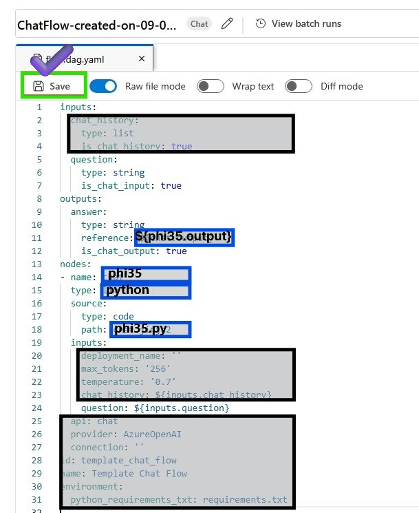
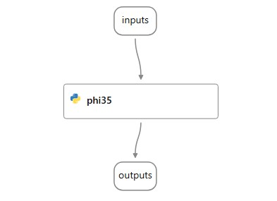
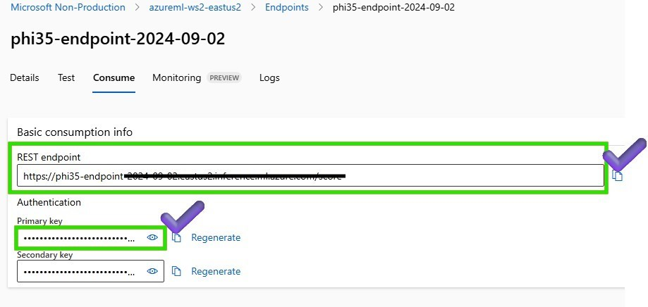
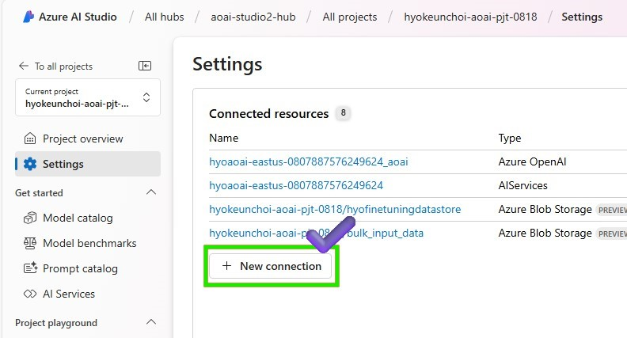
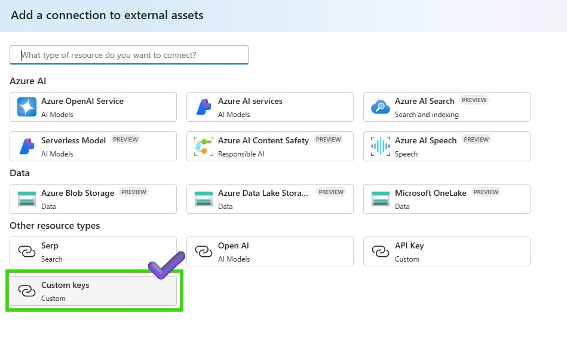
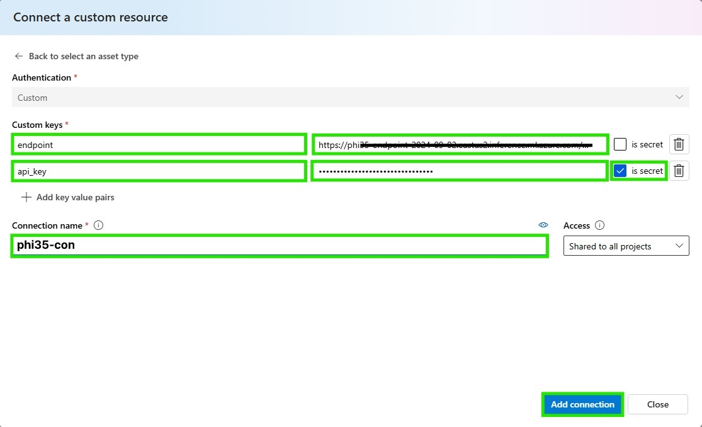
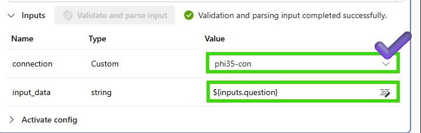

# Lab 3.2.1 Prototyping a Gen AI app using the fine-tuned model with Azure AI Studio Prompt Flow

### 前提 条件

- AI Hub と AI プロジェクト リソースを作成できる Azure サブスクリプション。
- Azure ML Studio でのファインチューニングされたモデルのオンライン エンドポイント
- Azure AI Studio にデプロイされた gpt-4o モデル 


### タスク

- ファインチューニングしたモデルで簡単なPoCを実行します。
- プロンプトを実行したときにどのような結果が生成されるかを確認します。

### 目次
    1️⃣ 基本的なチャットフローを作成する  
    2️⃣ ファインチューニングされたphi3.5エンドポイントをPythonノードに統合します

### 1️⃣ 基本的なチャットフローを作成する 

チャットフローの定義: 新しいチャットフローを作成し、チャットフロー構造を定義します

1. Azure AI Studio > プロンプト フロー > [+ 作成] をクリックして新しいフローを作成します


2. ユーザーフレンドリーなチャットインターフェースを取得するには、[チャットフロー]を選択します


3. Promptflowファイルを保存するフォルダ名を入力し、[作成]ボタンをクリックします


4. RAWファイルモデルとして変更して、基本的なチャットフローを変更します


5. flow.dag.yaml を変更し、新しいチャット フロー構造を定義します。以下のソースコードも参照できます。


```
inputs:
  question:
    type: string
    is_chat_input: true
outputs:
  answer:
    type: string
    reference: ${phi35.output}
    is_chat_output: true
nodes:
- name: phi35
  type: python
  source:
    type: code
    path: phi35.py
  inputs:
    question: ${inputs.question}
  
```

6. Raw ファイル モードを再度変更し、変更したフローを保存します。更新されたチャット フローを実行するためにコンピューティング インスタンスが実行されていることを確認します


7. 変更したフローを確認する



### 2️⃣ファインチューニングされたphi3.5エンドポイントをPythonノードに統合します
1. まず、エンドポイント情報を取得して接続を作成するには、>作成したAzure Machine Learningワークスペースに移動し、[エンドポイント]>[消費]タブで>RESTエンドポイントとプライマリキーを認証情報としてコピーします。


2. Azure AI Studio の > 設定 > に戻り、デプロイされたファインチューニングされた phi3.5 エンドポイントと統合するための新しい接続を作成します。


3. 接続タイプとして [カスタム キー] を選択し、接続情報を入力します


4. Python ノードに接続情報を追加して、デプロイされた phi3.5 エンドポイントをリクエストし、接続の追加をクリックします


5. 以下のコードをPythonノードに添付して、ファインチューニングされたphi3.5エンドポイントをリクエストします。 

{: .note}
このエンドポイントは Azure Machine Learning のファインチューニングされたオンライン エンドポイントに基づいているため、入力と出力の仕様は、2_slm-fine-tuning-mlstudio の前の手順で提供されたスコアリング スクリプトに従います。[](../../2_slm-fine-tuning-mlstudio/phi3/src_serve/score.py) Azure ML Studio で score.py ファイルを確認して、入力形式と出力形式を取得してください。scoring_scriptを理解するには、[スコアリング スクリプトの理解を参照してください](https://learn.microsoft.com/en-us/azure/machine-learning/how-to-deploy-online-endpoints?view=azureml-api-2&tabs=python#understand-the-scoring-script)。

```python
import urllib
import json
from promptflow import tool
from promptflow.connections import CustomConnection


def chat(input_data: str, connection: CustomConnection) -> str:
    
    # Request data goes here
    # The example below assumes JSON formatting which may be updated
    # depending on the format your endpoint expects.
    # More information can be found here:
    # https://docs.microsoft.com/azure/machine-learning/how-to-deploy-advanced-entry-script
    data = {
        "input_data": 
            [
                {"role": "user", "content": "Tell me Microsoft's brief history."},
                {"role": "assistant", "content": "Microsoft was founded by Bill Gates and Paul Allen on April 4, 1975, to develop and sell a BASIC interpreter for the Altair 8800."},
                {"role": "user", "content": input_data}
            ],
        "params": {
                "temperature": 0.7,
                "max_new_tokens": 512,
                "do_sample": True,
                "return_full_text": False
        }
    }

    body = str.encode(json.dumps(data))

    url = connection.endpoint
    # Replace this with the primary/secondary key, AMLToken, or Microsoft Entra ID token for the endpoint
    api_key = connection.key
    if not api_key:
        raise Exception("A key should be provided to invoke the endpoint")


    headers = {'Content-Type':'application/json', 'Authorization':('Bearer '+ api_key)}

    req = urllib.request.Request(url, body, headers)

    try:
        response = urllib.request.urlopen(req)

        response = response.read().decode()
        print(response)
        
        result = json.loads(response)["result"]
        
        return result
    except urllib.error.HTTPError as error:
        print("The request failed with status code: " + str(error.code))

        # Print the headers - they include the requert ID and the timestamp, which are useful for debugging the failure
        print(error.info())
        print(error.read().decode("utf8", 'ignore'))

@tool
def my_python_tool(input_data: str, connection: CustomConnection) -> str:
    """
    Tool function to process input data and query the Phi-3 model.
    """
    return chat(input_data, connection)
```

6. Python ノードの入力パラメータを追加して、デプロイされた phi3.5 エンドポイントをリクエストします。


7. Python ノードを保存し、チャット フローを実行して phi3.5 モデルをテストします


8. チャットウィンドウでphi3.5モデルをテストしましょう

> マイクロソフトの簡単な歴史は何ですか? 

