# Lab 3.2.2 SLM and LLM comparison with Azure AI Studio Prompt Flow (UI)

### Prerequisites

- An Azure subscription where you can create an AI Hub and AI project Resource.
- Online endpoint of the fine-tuned model in Azure ML Studio
- Deployed gpt-4o model in Azure AI Studio 

### Task

- I want to do some testing, log tracing and monitoring to determine the right model. 

### TOC
    1️⃣ Create another model using LLM Node 
    2️⃣ Interact with the Chat: Test and trace the chat flow

### 1️⃣ Create another model using LLM Node to compare the results
1. Create a new LLM Node to test the different model and prompt.
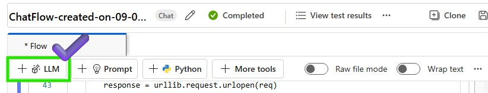

2. Put the LLM Node name and select the model type as LLM
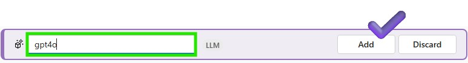

3. Add the connection parameters of the LLM Node to call the deployed LLM model and Click Validate and parse input. Don't forget to add inputs to the LLM Node.
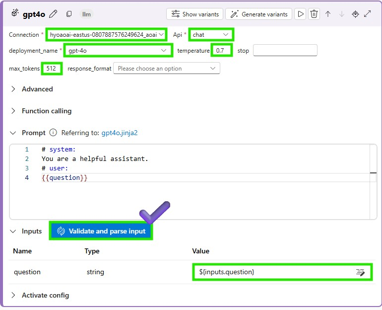

4. Add more outputs to the LLM Node to get the generated text from the LLM model. Chat output radio box should be checked to display the generated text on the chat window.
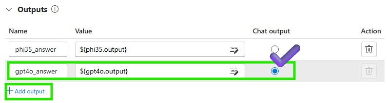

5. Save the LLM Node and run the chat flow to test the LLM model
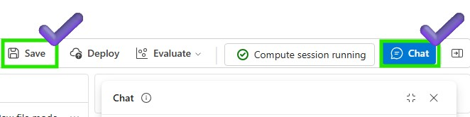

### 2️⃣ Interact with the Chat: Test and trace the chat flow
1. Let's test the phi3.5 and LLM model on the chat window
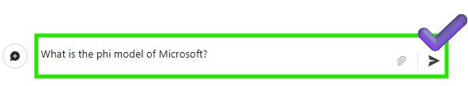

2. You can review the both phi3.5 and LLM successfully executed  
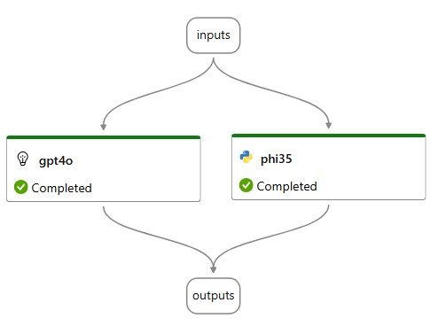

3. Click the View outputs to check the each model's output
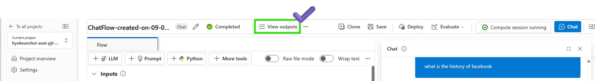

4. You can trace each model to check the performance and behavior of the model
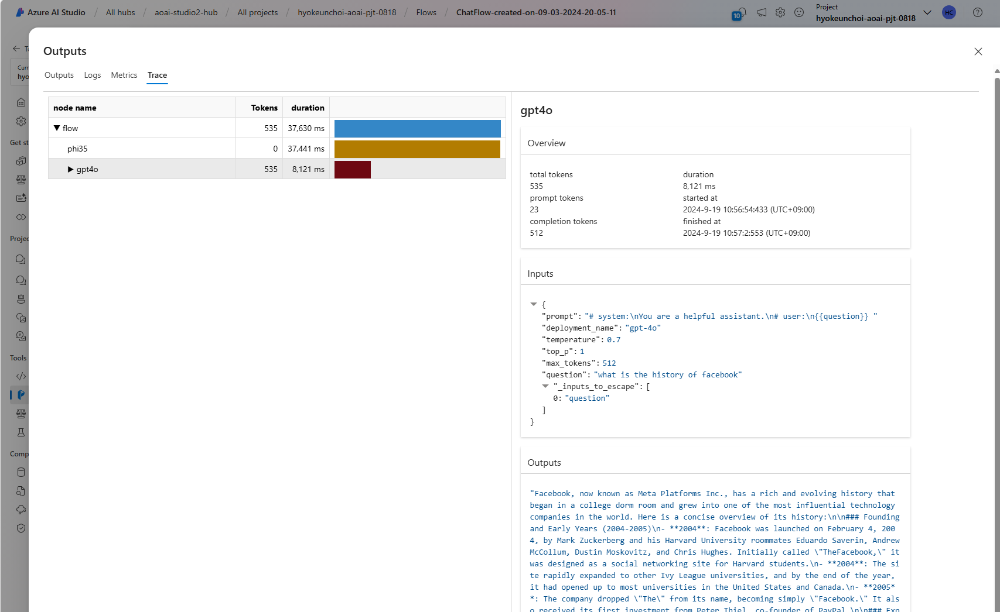

5. If you go back to the Azure ML studio, you can get log and monitor your endpoint to check the performance and behavior of the model.
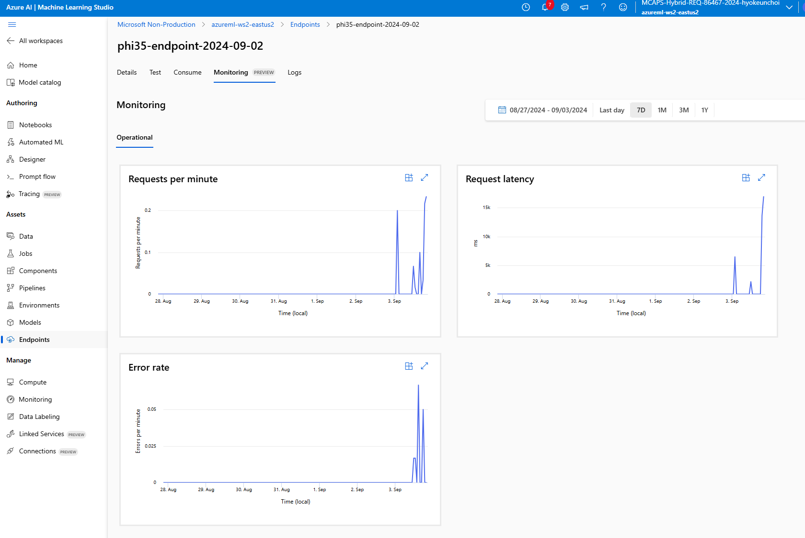
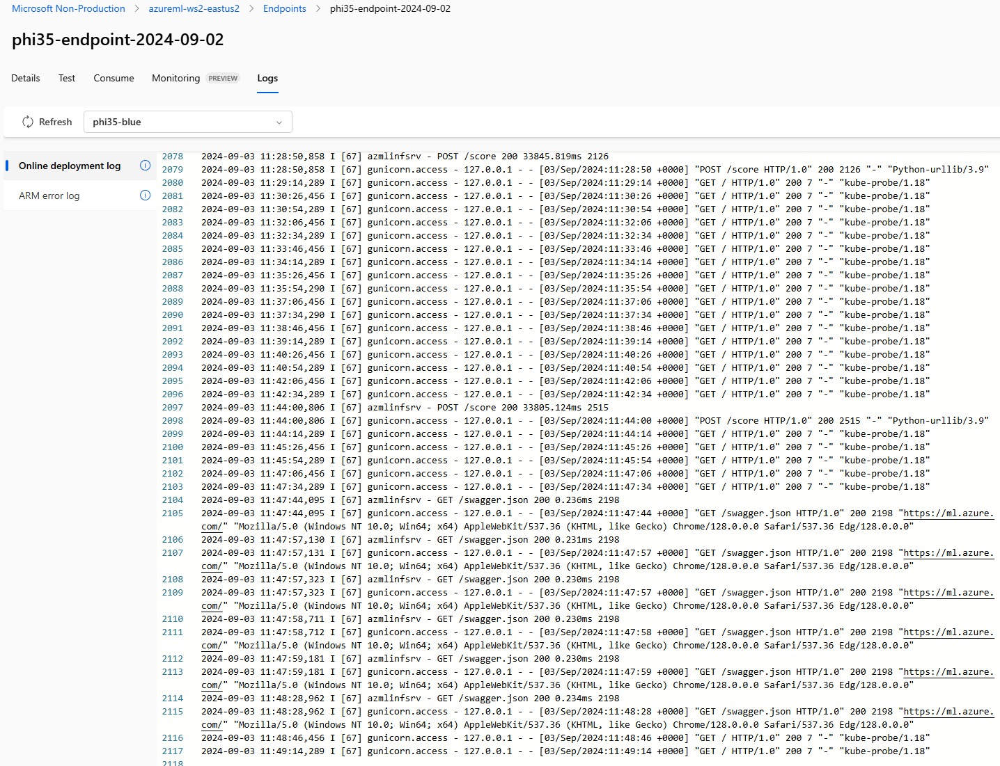

