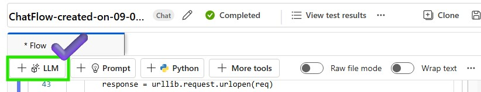
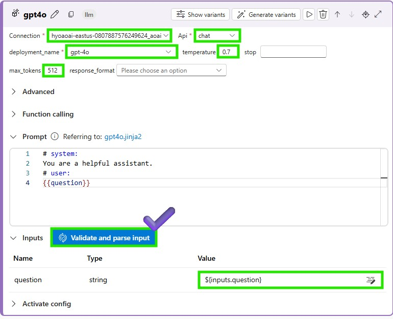
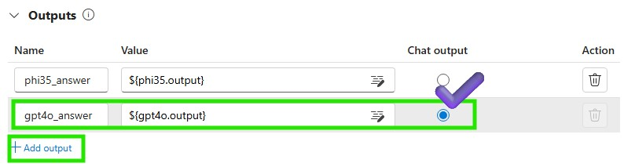
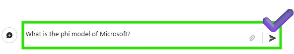

# Lab 3.2.2 SLM and LLM comparison with Azure AI Studio Prompt Flow (UI)

### 前提 条件

- AI Hub と AI プロジェクト リソースを作成できる Azure サブスクリプション
- Azure ML Studio での微調整されたモデルのオンライン エンドポイント
- Azure AI Studio にデプロイされた gpt-4o モデル 

### タスク

- 適切なモデルを決定するために、テスト、ログトレース、監視を行います

### 目次
    1️⃣ Create another model using LLM Node 
    2️⃣ Interact with the Chat: Test and trace the chat flow

### 1️(2) LLMノードを使用して別のモデルを作成し、結果を比較する
1. 新しい LLM ノードを作成して、異なるモデルとプロンプトをテストします。

2. LLM ノード名を入力し、モデル タイプとして LLM を選択します

3. LLM ノードの接続パラメータを追加して、デプロイされた LLM モデルを呼び出し、[検証して入力を解析] をクリックします。LLM ノードに入力を追加することを忘れないでください。

4. LLM ノードに出力をさらに追加して、LLM モデルから生成されたテキストを取得します。チャット出力ラジオボックスをオンにすると、生成されたテキストがチャットウィンドウに表示されます。

5. LLM ノードを保存し、チャット フローを実行して LLM モデルをテストします

### 2️⃣ チャットとの対話:チャットフローをテストおよび追跡します
1. チャットウィンドウで phi3.5 と LLM モデルをテストしてみましょう

2. phi3.5 と LLM の両方が正常に実行されたことを確認できます 

3. [出力の表示] をクリックして、各モデルの出力を確認します
![[出力の表示] をクリックします](images/click_view_output.jpg)

4. 各モデルをトレースして、モデルのパフォーマンスと動作を確認できます

5. Azure ML Studio に戻ると、ログを取得し、エンドポイントを監視して、モデルのパフォーマンスと動作を確認できます。

