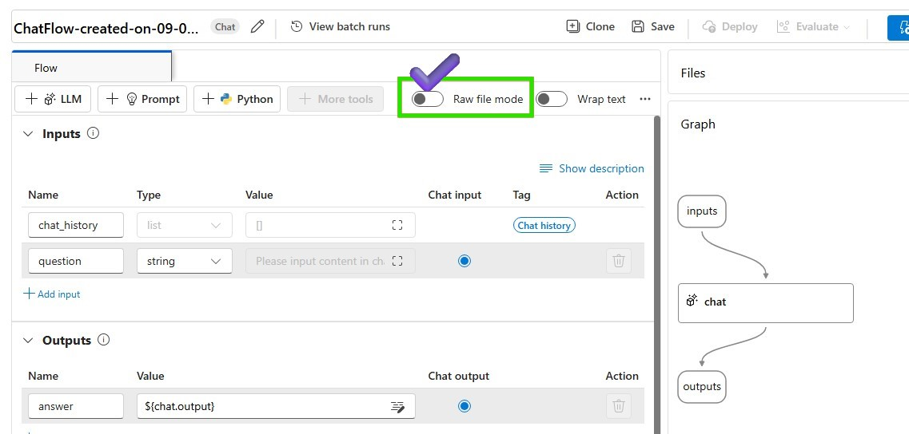
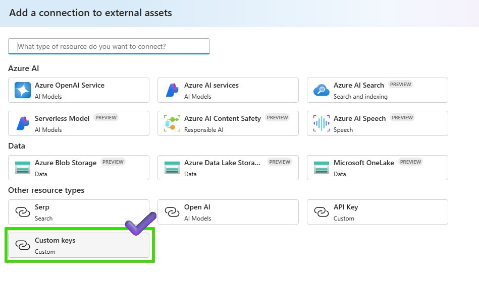
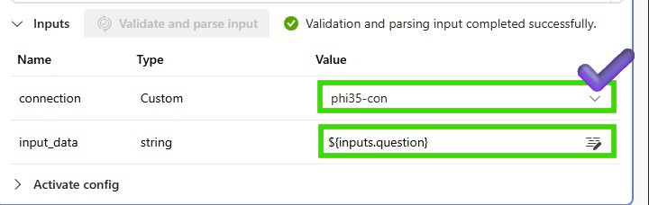
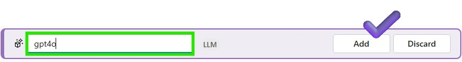
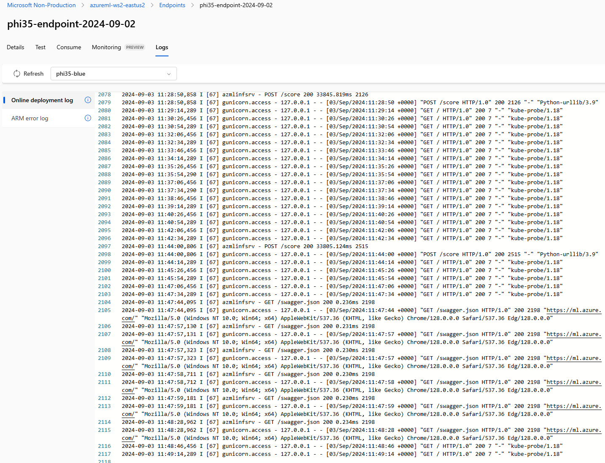

# Lab 3.2 Azure AI Studio Prompt Flow를 활용한 Gen AI App 프로토타이핑

### Prerequisites

- AI 허브 및 AI 프로젝트 리소스를 만들 수 있는 Azure 구독
- 파인튜닝한 모델의 온라인 엔드포인트 
- Azure AI Studio에 배포된 gpt-4o 모델


### Task

- 파인튜닝한 모델에 대한 간단한 PoC를 실행하고 싶습니다. 
- 프롬프트를 실행 할 때 어떤 결과가 생성되는지 확인하고 싶습니다. 
- 모델을 결정하기 위한 테스트와 간단한 모니터링을 해보고 싶습니다. 

### TOC
- 1️⃣ 기본 채팅 플로우 만들기 
- 2️⃣ 파이3.5 엔드포인트를 파이썬 노드에 연결하기
- 3️⃣ LLM 노드를 사용하여 다른 모델 추가하기
- 4️⃣ 채팅과 상호작용하기: 채팅 흐름 테스트 및 추적

### 1️⃣ 기본 채팅 플로우 만들기 
채팅 플로우 정의하기: 새 채팅 플로우 만들기 및 채팅 플로우 구조 정의하기
1. Azure AI Studio > 프롬프트 플로우 > +생성을 클릭하여 새 플로우를 만듭니다.


2. 채팅 UI를 위해 채팅 플로우를 선택합니다.


3. 프롬프트플로우 파일을 저장할 폴더 이름을 입력하고 만들기 버튼을 클릭합니다.


4. raw file model로 변경하여 기본 채팅 플로우를 수정합니다. 


5. flow.dag.yaml을 수정하여 새로운 채팅 플로우 구조를 정의합니다. 아래의 소스 코드를 참조할 수도 있습니다. 


```
inputs:
  question:
    type: string
    is_chat_input: true
outputs:
  answer:
    type: string
    reference: ${phi35.output}
    is_chat_output: true
nodes:
- name: phi35
  type: python
  source:
    type: code
    path: phi35.py
  inputs:
    question: ${inputs.question}
  
```

6. Raw file mode로 다시 변경하고 수정한 플로우를 저장합니다. 업데이트된 채팅 플로우를 실행하기 위해 컴퓨팅 인스턴스가 실행 중인지 확인합니다.


7. review the modified flow 


### 2️⃣ 파이3.5 엔드포인트를 파이썬 노드에 연결하기
1. 먼저, 연결을 만들기 위한 엔드포인트 정보를 가져오려면 생성한 Azure Machine Learning workspace > Endpoints > Consume 탭으로 이동하여 REST 엔드포인트와 기본 키를 인증 정보로 복사합니다.


2. Azure AI Studio > Settings > Create a new connection을 클릭합니다 


3. 연결 유형을 Custom Key로 선택하고 연결 정보를 입력합니다. 


4. 배포된 phi3.5 엔드포인트를 요청할 파이썬 노드에 연결 정보를 추가하고 Add Connection을 클릭합니다.


5. 배포된 phi3.5 엔드포인트를 호출하기 위해 파이썬 노드에 아래 코드를 첨부합니다. 
```
import urllib
import json
from promptflow import tool
from promptflow.connections import CustomConnection


def chat(input_data: str, connection: CustomConnection) -> str:
    
    # Request data goes here
    # The example below assumes JSON formatting which may be updated
    # depending on the format your endpoint expects.
    # More information can be found here:
    # https://docs.microsoft.com/azure/machine-learning/how-to-deploy-advanced-entry-script
    data = {
        "input_data": 
            [
                {"role": "user", "content": "Tell me Microsoft's brief history."},
                {"role": "assistant", "content": "Microsoft was founded by Bill Gates and Paul Allen on April 4, 1975, to develop and sell a BASIC interpreter for the Altair 8800."},
                {"role": "user", "content": input_data}
            ],
        "params": {
                "temperature": 0.7,
                "max_new_tokens": 512,
                "do_sample": True,
                "return_full_text": False
        }
    }

    body = str.encode(json.dumps(data))

    url = connection.endpoint
    # Replace this with the primary/secondary key, AMLToken, or Microsoft Entra ID token for the endpoint
    api_key = connection.key
    if not api_key:
        raise Exception("A key should be provided to invoke the endpoint")


    headers = {'Content-Type':'application/json', 'Authorization':('Bearer '+ api_key)}

    req = urllib.request.Request(url, body, headers)

    try:
        response = urllib.request.urlopen(req)

        response = response.read().decode()
        print(response)
        
        result = json.loads(response)["result"]
        
        return result
    except urllib.error.HTTPError as error:
        print("The request failed with status code: " + str(error.code))

        # Print the headers - they include the requert ID and the timestamp, which are useful for debugging the failure
        print(error.info())
        print(error.read().decode("utf8", 'ignore'))

@tool
def my_python_tool(input_data: str, connection: CustomConnection) -> str:
    """
    Tool function to process input data and query the Phi-3 model.
    """
    return chat(input_data, connection)
```

6. 파이썬 노드의 입력 매개변수를 추가하여 배포된 phi3.5 엔드포인트를 요청합니다.


7. 파이썬 노드를 저장하고 채팅 플로우를 실행하여 phi3.5 모델을 테스트합니다.


8. 채팅 창에서 phi3.5 모델을 테스트해 보겠습니다.

> What is the brief history of Microsoft? 

### 3️⃣ LLM 노드를 사용하여 다른 모델 추가하기
1. 새 LLM 노드를 생성하여 다른 모델과 프롬프트를 테스트합니다.


2. LLM 노드 이름을 입력하고 모델 유형을 LLM으로 선택합니다.


3. 배포된 LLM 모델을 호출할 LLM 노드의 연결 파라미터를 추가하고 Validate and parse input을 클릭합니다. LLM 노드에 입력을 추가하는 것을 잊지 마세요.


4. LLM 모델에서 생성된 텍스트를 가져오려면 LLM 노드에 출력을 더 추가합니다. 생성된 텍스트를 채팅창에 표시하려면 Chat output을 체크해야 합니다.


5. LLM 노드를 저장하고 채팅 플로우를 실행하여 LLM 모델을 테스트합니다.


### 4️⃣ 채팅과 상호작용하기: 채팅 흐름 테스트 및 추적
1. 채팅 창에서 phi3.5 및 LLM 모델을 테스트해 보겠습니다.


2. phi3.5와 LLM의 실행이 완료되면 Tracing 화면을 통해 output 결과를 검토할 수 있습니다. 


3. Azure ML studio를 통해 로그와 엔드포인트 모니터링을 할 수 있고 모델의 성능과 동작을 확인할 수 있습니다.



