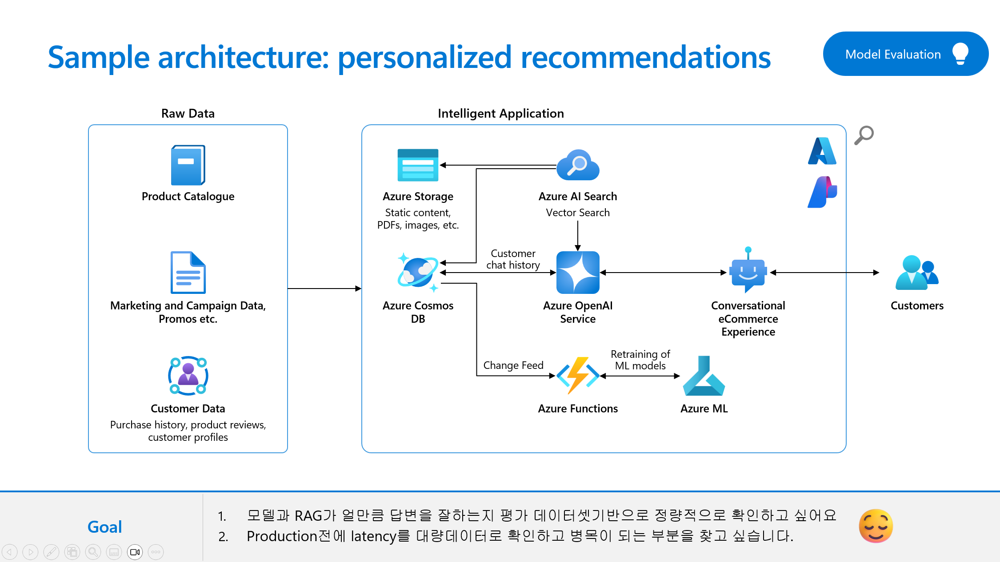

# Lab3.3 Evaluation Features in Azure AI Studio and Prompt Flow

## Overview
In this lab, you will evaluate

### Prerequisites

An Azure subscription where you can create an AI Hub and AI project Resource.

### Task

- 모델과 RAG가 얼만큼 답변을 잘하는지 평가 데이터셋기반으로 정량적으로 확인하고 싶어요. 
- Production전에 latency를 대량데이터로 확인하고 병목이 되는 부분을 찾고 싶습니다.  

### TOC
- 1️⃣ Create a QnA Relevance Evaluation flow 
- 2️⃣ Review the QnA Relevance Evaluation flow and variants 
- 3️⃣ View Test Result of the Evaluation flow
- 4️⃣ Automated evaluation for Korean and English math questions

### 1️⃣ Create a QnA Relevance Evaluation flow 
- 

### 2️⃣ Review the Evaluation flow and variants 
- 
- 

### 3️⃣ View Test Result of the Evaluation flow
- 

### 4️⃣ Automated evaluation for Korean and English math questions

### 🧪 Hands-on
### 🗑️ Clean up resources

https://learn.microsoft.com/en-us/azure/ai-studio/how-to/flow-deploy 