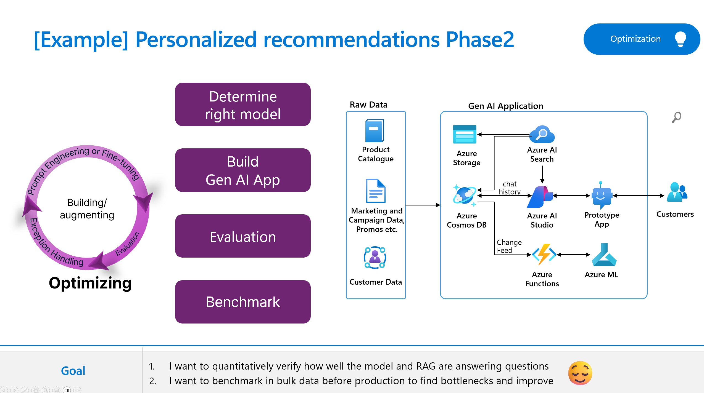

# Lab 3.3 Scenario 3: Evaluate your models using Prompt Flow to improve the quality of service

## Overview
In this lab, we will explore how to use the evaluation features in Azure AI Studio and promptflow to perform A/B testing with your LLM nodes to evaluate the performance of prompt and LLM. You will learn how to create your variants, which can help you test the model's behavior under different conditions, such as different wording, formatting, context, temperature, or top-k, compare, and find the best prompt and configuration that maximizes the model's accuracy, diversity, or coherence.

### 🥇Other Resources
Here are the reference architectures, best practices and guidances on this topic. Please refer to the resources below. 

- https://learn.microsoft.com/en-us/azure/ai-studio/concepts/evaluation-approach-gen-ai
- https://github.com/Azure-Samples/llm-evaluation
