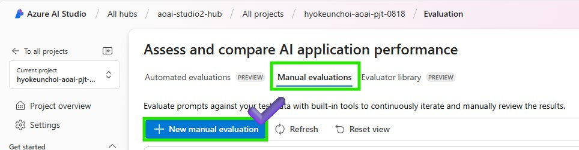
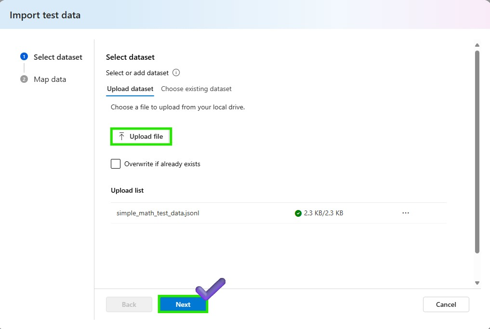
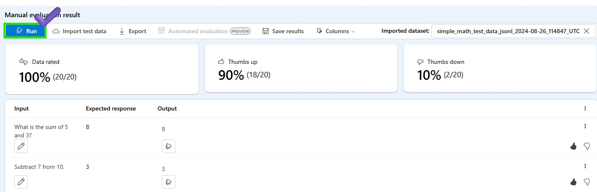
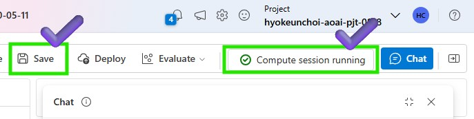
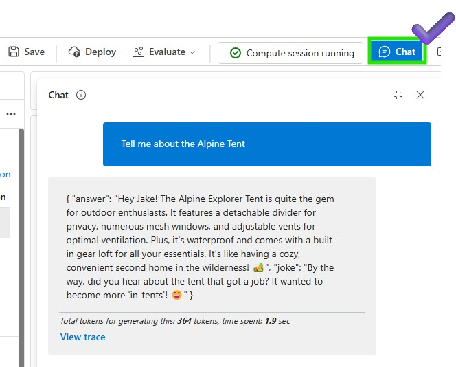

# Lab 3.3.1 Evaluate your models using Prompt Flow (UI)


[ジェネレーティブAIアプリケーションの評価とモニタリング](https://learn.microsoft.com/en-us/azure/ai-studio/concepts/evaluation-approach-gen-ai#evaluating-and-monitoring-of-generative-ai-applications)

### 前提 条件

- AI Hub と AI プロジェクト リソースを作成できる Azure サブスクリプション
- Azure AI Studio にデプロイされた gpt-4o モデル


### タスク

- モデルとRAGがどれだけ疑問に答えているかを定量的に検証したい 
- 本番環境で一括データをベンチマークし、ボトルネックを見つけて改善したい 


### 目次
- 1️(2)選択したモデルの出力を確認するための手動評価
- 2️(2) LLMバリアントでA/Bテストを実施

- 3️⃣ バリアントによる自動評価の作成

- 4️⃣ プロンプトフローでカスタム評価フローを作成

### 1️(2)選択したモデルの出力を確認するための手動評価 
1. Azure AI Studio の > Tools > Evaluation に移動する
2. 「手動評価」タブをクリックして、AIアプリケーションのパフォーマンスを評価および比較するための手動評価を作成します。


3. 構成でテストするモデルを選択し、以下のシステムメッセージを更新します。 
```
You are a math assistant, and you are going to read the context which includes simple math questions and answer with numbers only. 
```
4. 「テストデータのインポート」ボタンをクリックして、テストデータをインポートします。コンテキストを使用してモデルをテストする場合は、データを追加することもできます。

5. モデルでテストするデータセットを選択します。


6. テストデータをマップします。入力として question を選択し、出力として answer を選択します。追加ボタンをクリックして、テストデータをインポートします。


7. [実行] ボタンをクリックして、テスト データを使用してモデルをテストします。テストが完了したら、結果を表示してエクスポートしたり、結果を期待される回答と比較したりすることもできます。親指を上または下に使用して、モデルのパフォーマンスを評価します。この結果は手動評価用であるため、結果データセットを自動評価に引き継いで、モデルを一括データで評価できます。


### 2️(2) LLMバリアントでA/Bテストを実施
バリアントを使用した新しいチャットフローを作成する 
1. Azure AI Studio > プロンプト フロー > [+ 作成] をクリックして新しいフローを作成します


2. ユーザーフレンドリーなチャットインターフェースを取得するには、[チャットフロー]を選択します


3. Promptflowファイルを保存するフォルダ名を入力し、[作成]ボタンをクリックします


4. RAWファイルモデルとして変更して、基本的なチャットフローを変更します


5. flow.dag.yamlを修正し、以下のソースコードを添付してください。 
```
id: chat_variant_flow
name: Chat Variant Flow
inputs:
  question:
    type: string
    is_chat_input: true
  context:
    type: string
    default: >
      The Alpine Explorer Tent boasts a detachable divider for privacy, 
      numerous mesh windows and adjustable vents for ventilation, and 
      a waterproof design. It even has a built-in gear loft for storing 
      your outdoor essentials. In short, it's a blend of privacy, comfort, 
      and convenience, making it your second home in the heart of nature!
    is_chat_input: false
  firstName:
    type: string
    default: "Jake"
    is_chat_input: false
outputs:
  answer:
    type: string
    reference: ${chat_variants.output}
    is_chat_output: true
nodes:
- name: chat_variants
  type: llm
  source:
    type: code
    path: chat_variants.jinja2
  inputs:
    deployment_name: gpt-4o
    temperature: 0.7
    top_p: 1
    max_tokens: 512
    context: ${inputs.context}
    firstName: ${inputs.firstName}
    question: ${inputs.question}
  api: chat
  provider: AzureOpenAI
  connection: ''
environment:
  python_requirements_txt: requirements.txt
```
6. Raw ファイル・モードを再度変更し、デプロイされた LLM モデルを呼び出すように LLM ノードの接続パラメーターを追加し、[Validate and parse input] をクリックします。LLM ノードへの入力を所定の位置に確認します。


7. 以下のプロンプトをchat_variantsノードに添付して、デプロイされたモデルをリクエストします。 

```
system:
You are an AI assistant who helps people find information. As the assistant, 
you answer questions briefly, succinctly, and in a personable manner using 
markdown and even add some personal flair with appropriate emojis.

Add a witty joke that begins with “By the way,” or “By the way. 
Don't mention the customer's name in the joke portion of your answer. 
The joke should be related to the specific question asked.
For example, if the question is about tents, the joke should be specifically related to tents.

Respond in your language with a JSON object like this.
{
  “answer": 
  “joke":
}

# Customer
You are helping {{firstName}} to find answers to their questions.
Use their name to address them in your responses.

# Context
Use the following context to provide a more personalized response to {{firstName}}:
{{context}}

user:
{{question}}
```

8. 変更したフローを保存します。更新されたチャット フローを実行するためにコンピューティング インスタンスが実行されていることを確認します


9. チャットウィンドウで現在のフローをテストしてみましょう


10. これで、バリアントを生成し、韓国語で書かれたプロンプトと結果を比較できます。「generate variant (バリアントの生成)」ボタンをクリックして、新しいバリアントを作成します。


11. 以下に、バリアント名と韓国語のプロンプトを追加します。保存ボタンをクリックして、バリアントを保存します。

```
system:
당신은 사람들이 정보를 찾을 수 있도록 도와주는 AI 어시스턴트입니다. 어시스턴트로서 
를 사용하여 질문에 간결하고 간결하게, 그리고 개성 있는 방식으로 답변하고 
마크다운을 사용하여 간단하고 간결하게 답변하고 적절한 이모티콘으로 개인적인 감각을 더할 수도 있습니다.

"그런데, "로 시작하는 재치 있는 농담을 추가하세요. 답변의 농담 부분에서는 고객의 이름을 언급하지 마세요. 
농담은 질문한 특정 질문과 관련이 있어야 합니다.
예를 들어 텐트에 대한 질문인 경우 농담은 텐트와 구체적으로 관련된 것이어야 합니다.

다음과 같은 json 객체로 한국어로 응답합니다.
{
  "answer": 
  "joke":
}

# Customer
당신은 {{firstName}} 이 질문에 대한 답변을 찾도록 돕고 있습니다.
답변에 상대방의 이름을 사용하여 상대방을 언급하세요. 

# Context
다음 컨텍스트를 사용하여 {{firstName}}에게 보다 개인화된 응답을 제공하세요. 한국어로 답변 바랍니다:
{{context}}

user:
{{question}}
```

12. これで、チャットウィンドウでバリアントの1つをデフォルトとして設定して、バリアントをテストできます。「実行」ボタンをクリックして、バリアントをテストします。 


### 3️⃣ バリアントを使用した QnA 関連性評価フローの作成
1. Azure AI Studio の > Tools > Evaluation に移動する

2. [自動評価] タブの [+ 新しい評価] をクリックして作成します。 

3. 「プロンプトフロー」をクリックして、その出力を評価するフローを選択します


4. 評価の基本情報を追加します。評価の名前を「variant1_en」として入れ、評価するフローを選択します。評価シナリオとして [コンテキストを使用した質問と回答] を選択します。「次へ」ボタンをクリックして続行します。


5. データセットとして 'simple_qna_data_en.jsonl' を追加し、question、firstName、context、dataset 列をマップします。「次へ」ボタンをクリックして続行します。


6. 「評価メトリック」を選択します。モデルを評価する指標を選択できます。接続モデルとデプロイモデルを入力して [次へ] ボタンをクリックし、最終的な設定を確認して [送信] ボタンをクリックして評価を開始/待機します。


>  +ご参考までに<br>
エバリュエーターは、評価を実行するために使用できる資産です。SDK でエバリュエーターを定義し、評価を実行して 1 つ以上のメトリックのスコアを生成できます。プロンプトフローSDKでAI支援の品質および安全性評価者を使用するには、[プロンプトフローSDKによる評価を確認してください](https://learn.microsoft.com/en-us/azure/ai-studio/how-to/develop/flow-evaluate-sdk)  
