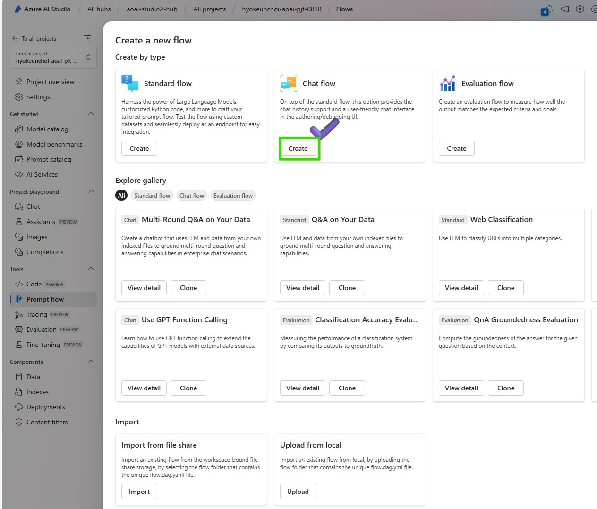

# Lab3.3 Evaluate your models using Prompt Flow to keep optimizing

## Overview
In this lab, you will explore your model in Azure AI studio and conduct A/B testing with your LLM nodes to evaluate the performance of prompt and LLM. You will learn how to create your variants which can help you test the model’s behavior under different conditions, such as different wording, formatting, context, temperature, or top-k, compare and find the best prompt and configuration that maximizes the model’s accuracy, diversity, or coherence.


### Prerequisites

- An Azure subscription where you can create an AI Hub and AI project Resource
- Deployed gpt-4o model in Azure AI Studio


### Task

- I want to quantitatively verify how well the model and RAG are answering questions 
- I want to benchmark in bulk data before production to find bottlenecks and improve 


### TOC
- 1️⃣ Manual evaluations to review outputs of the selected model
- 2️⃣ Conduct A/B testing with your LLM variants

- 3️⃣ Create QnA Relevance Evaluation flow with variants
- 4️⃣ Automated evaluation for Korean and English math questions

### 1️⃣ Manual evaluations to review outputs of the selected model 
1. Go to the Azure AI Studio and select the model you want to evaluate.
2. Click on the "Evaluation" tab to create an manual evaluation flow.
3. Create a manual evaluation flow with the selected model.

### 2️⃣ Conduct A/B testing with your LLM variants
Create a new chat flow with variants 
1. Azure AI Studio > Prompt flow > Click +Create to create a new flow


2. In order to get a user-friendly chat interface, select Chat flow


3. Put your folder name to store your Promptflow files and click the Create button


4. Change as raw file model to modify your basic chat flow


5. Modify flow.dag.yaml attach the source code below. 
```
id: chat_variant_flow
name: Chat Variant Flow
inputs:
  question:
    type: string
    is_chat_input: true
  contenxt:
    type: string
    default: >
      The Alpine Explorer Tent boasts a detachable divider for privacy, 
      numerous mesh windows and adjustable vents for ventilation, and 
      a waterproof design. It even has a built-in gear loft for storing 
      your outdoor essentials. In short, it's a blend of privacy, comfort, 
      and convenience, making it your second home in the heart of nature!
    is_chat_input: false
  firstName:
    type: string
    default: "Jake"
    is_chat_input: false
outputs:
  answer:
    type: string
    reference: ${chat_variants.output}
    is_chat_output: true
nodes:
- name: chat_variants
  type: llm
  source:
    type: code
    path: chat_variants.jinja2
  inputs:
    deployment_name: gpt-4o
    temperature: 0.7
    top_p: 1
    max_tokens: 512
    context: ${inputs.contenxt}
    firstName: ${inputs.firstName}
    question: ${inputs.question}
  api: chat
  provider: AzureOpenAI
  connection: ''
environment:
  python_requirements_txt: requirements.txt
```
6. Change the Raw file mode again and Add the connection parameters of the LLM Node to call the deployed LLM model and Click Validate and parse input. Check inputs to the LLM Node in place.


7. attach the prompt below on your chat_variants Node to request the deployed model. 
```
system:
You are an AI assistant who helps people find information. As the assistant, 
you answer questions briefly, succinctly, and in a personable manner using 
markdown and even add some personal flair with appropriate emojis.

Add a witty joke that begins with “By the way,” or “By the way. 
Don't mention the customer's name in the joke portion of your answer. 
The joke should be related to the specific question asked.
For example, if the question is about tents, the joke should be specifically related to tents.

Respond in your language with a JSON object like this.
{
  “answer": 
  “joke":
}

# Customer
You are helping {{firstName}} to find answers to their questions.
Use their name to address them in your responses.

# Context
Use the following context to provide a more personalized response to {{firstName}}:
{{context}}

user:
{{question}}
```

8. Save your modified flow. Make sure that your compute instance is running to execute the updated chat flow


9. Let's test the current flow on the chat window


10. Now you can generate a variant and compare the results with the prompt written in Korean. Click the generate variant button to create a new variant.


11. Add the variant name and the prompt in Korean below. Click the save button to save the variant.
```
system:
당신은 사람들이 정보를 찾을 수 있도록 도와주는 AI 어시스턴트입니다. 어시스턴트로서 
를 사용하여 질문에 간결하고 간결하게, 그리고 개성 있는 방식으로 답변하고 
마크다운을 사용하여 간단하고 간결하게 답변하고 적절한 이모티콘으로 개인적인 감각을 더할 수도 있습니다.

"그런데, "로 시작하는 재치 있는 농담을 추가하세요. 답변의 농담 부분에서는 고객의 이름을 언급하지 마세요. 
농담은 질문한 특정 질문과 관련이 있어야 합니다.
예를 들어 텐트에 대한 질문인 경우 농담은 텐트와 구체적으로 관련된 것이어야 합니다.

다음과 같은 json 객체로 한국어로 응답합니다.
{
  "answer": 
  "joke":
}

# Customer
당신은 {{firstName}} 이 질문에 대한 답변을 찾도록 돕고 있습니다.
답변에 상대방의 이름을 사용하여 상대방을 언급하세요. 

# Context
다음 컨텍스트를 사용하여 {{firstName}}에게 보다 개인화된 응답을 제공하세요. 한국어로 답변 바랍니다:
{{context}}

user:
{{question}}
```

12. Now you can test the variants on the chat window setting one of variants as default. Click the Run button to test the variant. 


### 3️⃣ Create QnA Relevance Evaluation flow with variants
1. Go to the Azure AI Studio and select the model you want to evaluate.
2. Click on the "Evaluation" tab to create an evaluation flow.
3. Create a QnA Relevance Evaluation flow with variants.
4. Review the Evaluation flow and variants.

### 4️⃣ Automated evaluation for Korean and English math questions
