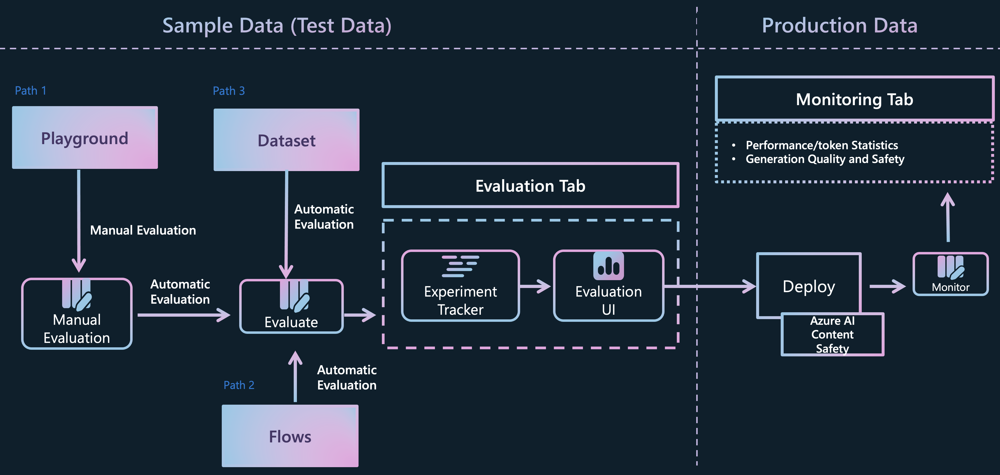

# Lab 3.3.2 groundness evaluation using Prompt Flow (Code)

[Evaluating and monitoring of generative AI applications](https://learn.microsoft.com/en-us/azure/ai-studio/concepts/evaluation-approach-gen-ai#evaluating-and-monitoring-of-generative-ai-applications)

### 前提 条件

- AI Hub と AI プロジェクト リソースを作成できる Azure サブスクリプション
- Azure AI Studio にデプロイされた gpt-4o モデル

### タスク

- モデルが疑問にどれだけうまく答えているかを定量的に検証したい 
- 本番環境で一括データをベンチマークし、ボトルネックを見つけて改善したい 

### 目次
    1️⃣ Execute batch run to get the base run data 
    2️⃣ Evaluate the "groundedness" by your evalution flow

### Jupyter Notebookを通じて作業
- promptflow python sdkを使用して、jupyter notebookでgroundness評価フローを作成して実行してみましょう。Azure [promptflow_with_evaluation_code.ipynb でフローを評価する方法を学習します](promptflow_with_evaluation_code.ipynb)
