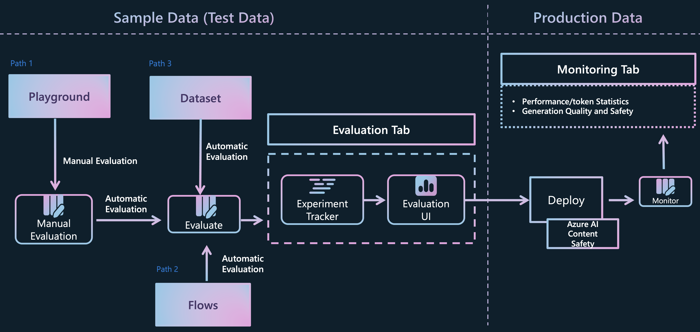

# Lab 3.4 groundness evaluation using Prompt Flow (Code)

[Evaluating and monitoring of generative AI applications](https://learn.microsoft.com/en-us/azure/ai-studio/concepts/evaluation-approach-gen-ai#evaluating-and-monitoring-of-generative-ai-applications)

### Prerequisites

- An Azure subscription where you can create an AI Hub and AI project Resource
- Deployed gpt-4o model in Azure AI Studio

### Task

- I want to quantitatively verify how well the model is answering questions 
- I want to benchmark in bulk data before production to find bottlenecks and improve 

### TOC
    1️⃣ Execute batch run to get the base run data 
    2️⃣ Evaluate the "groundedness" by your evalution flow

### workthough Jupyter Notebook
- Let's create and run the groundness evaluation flow on the jupyter notebook using promptflow python sdk. You will learn how to evaluate the flow on Azure [promptflow_with_evaluation_code.ipynb](promptflow_with_evaluation_code.ipynb)
