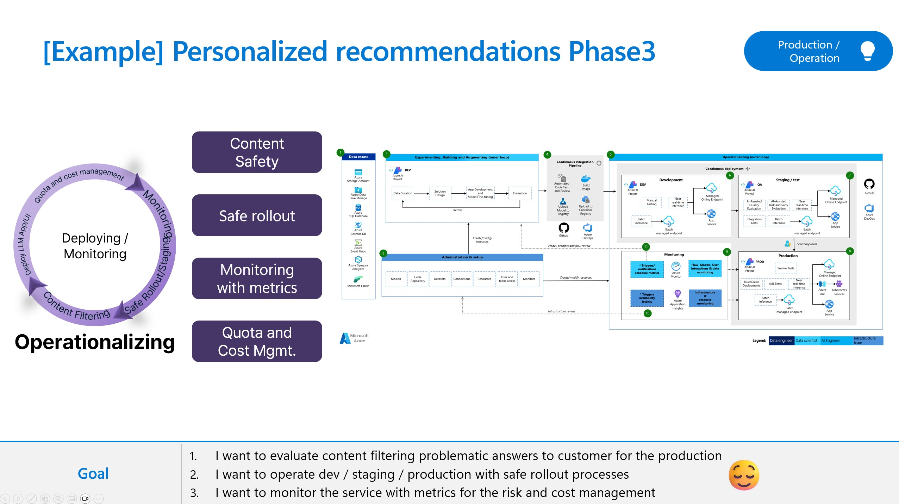

[English](README.md)

## 概要
このラボでは、コンテンツ フィルターを使用して運用環境のデプロイを確保する方法を体験します。このコンテンツ フィルタリング システムは Azure AI Content Safety を利用しており、有害なコンテンツの出力を検出して防止することを目的とした分類モデルのアンサンブルを通じて、プロンプト入力と完了出力の両方を実行することで機能します。API 構成とアプリケーション設計のバリエーションは、完了に影響を与え、フィルタリング動作に影響を与える可能性があります。

### 制限
コンテンツ フィルタリング モデルは、英語、ドイツ語、日本語、スペイン語、フランス語、イタリア語、ポルトガル語、中国語でトレーニングおよびテストされています。ただし、このサービスは他の多くの言語でも機能しますが、品質は異なる場合があります。いずれの場合も、独自のテストを行って、アプリケーションで機能することを確認する必要があります。

### その他のリソース
ここでは、このトピックに関するリファレンスアーキテクチャ、ベストプラクティス、およびガイダンスを示します。以下のリソースを参照してください。 

- https://learn.microsoft.com/en-us/azure/ai-studio/concepts/evaluation-approach-gen-ai
- https://github.com/Azure-Samples/llm-evaluation
