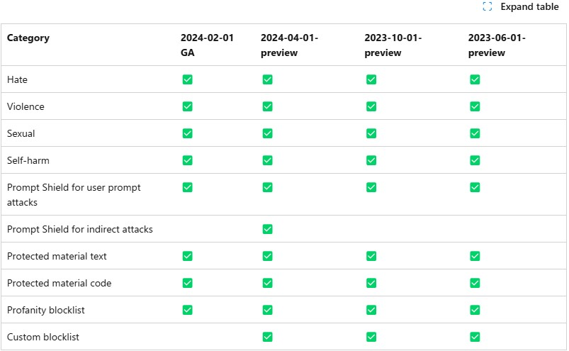

# Lab 3.4 Content Safety with Azure AI studio before production

[Annotation availability in each API version](https://learn.microsoft.com/en-us/azure/ai-services/openai/concepts/content-filter?tabs=warning%2Cuser-prompt%2Cpython-new#:~:text=See%20the%20following%20table%20for%20the%20annotation%20availability%20in%20each%20API%20version%3A)

### Prerequisites

- An Azure subscription where you can create an AI Hub and AI project Resource
- Registered the Fine-tune model and deployed LLMs in Azure AI Studio

### Task

- I want to filter problematic prompt from the end users 
- I want to rewrite the hamful keywords in the prompt before calling the LLMs 
- I want to monitor the service with metrics for the risk and cost management  

### TOC
- 1️⃣ Test your training dataset using content safety
- 3️⃣ Create a custom blocklist to manage inappropriate keyword in your prompt
- 2️⃣ Configure the content safety to filter to harmful contents for your orchestration flows
- 4️⃣ monitor the deployed application with metrics

### query rates
- Content Safety features have query rate limits in requests-per-second (RPS) or requests-per-10-seconds (RP10S) . See the following table for the rate limits for each feature. link: [Content Safety query rates](https://learn.microsoft.com/ko-kr/azure/ai-services/content-safety/overview)

| Pricing tier | Moderation APIs (text and image) | Prompt Shields | Protected material detection | Groundedness detection (preview) | Custom categories (rapid) (preview) | Custom categories (standard) (preview) | Multimodal     |
| ------------ | ----------------------------------- | -------------- | ------------------------------- | ----------------------------------- | -------------------------------------- | ----------------------------------------- | -------------- |
| F0           | 5 RPS                               | 5 RPS          | 5 RPS                           | N/A                                 | 5 RPS                                  | 5 RPS                                     | 5 RPS          |
| S0           | 1000 RP10S                          | 1000 RP10S     | 1000 RP10S                      | 50 RPS                              | 1000 RP10S                             | 5 RPS                                     | 10 RPS   |

### 1️⃣ Test your training dataset using content safety
1. Go to the Azure AI Studio > AI Services > Content Safety

2. Click on the "Test" tab to test your training dataset using content safety